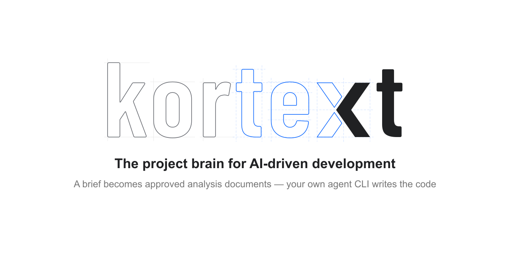

  <picture>
    <source media="(prefers-color-scheme: dark)" srcset="docs/assets/social-preview-dark.png">
    
  </picture>

  
  
  
  
  
  

🇹🇷 [For Turkish press 1](docs/tr/README.md)

Building products with AI, I kept hitting the same two walls: I could not see where the project stood, and at some point the model would drop the rules we had agreed on and start doing its own thing.

I know you have the same problem. You just have not named it yet.
I have. Its name is **Kortext**.

Kortext is a **product constitution** you agree on with the AI before development starts.

From the **`BRIEF.md`** you provide, **10 expert personas** write **14 architecture documents** — the one source of truth the model comes back to, every time.
If the brief you wrote is not enough, Kortext says so. The panel explains `BRIEF.md` and carries an example.

There is one human role, **`Prime`**.
The other personas: `product manager`, `architect`, `designer`, `growth expert`, `security engineer`, `DevOps engineer`, `DBA`, `compliance expert`, `copywriter` and `QA engineer`.

From the brief, Kortext produces `PRODUCT.md`, `STACK.md`, `STRUCTURE.md`, `ARCHITECTURE.md`, `DESIGN.md`, `GROWTH.md`, `SECURITY.md`, `ENVIRONMENT.md`, `DATABASE.md`, `API.md`, `LEGAL.md`, `CONTENT.md`, `ENGINEERING.md`, `TEST.md`. And, at the very end, an optional `EXPERIENCE.md`.

  

Every document written is put in front of you to review. Do not skip them — read. **Trust me, it is worth it.**

A document may carry **questions addressed to you**, a **change request** for a document written earlier, or a note for one still to be written. Those are the model's own findings.
Beside them, you can select any line, ask a question and ask for a change.
If the model asks for a change in a document and you accept it, that document goes back through the pipeline.
Because the documents depend on one another, a document sometimes comes back to you more than once, like a loop. That spends a fair number of tokens. But it spends them before the hours and tokens that would otherwise be wasted later. **On the whole, a much better deal.**

When the writing is done, your project folder holds a `.kortext` directory and, inside it, your product constitution.
From there on you carry on building with whatever AI tool, in whatever client, you already use.
At that point Kortext's job is done. No sign-in, no key, no API. Kortext collects nothing and keeps no telemetry. I am very curious how much it gets used, though — and if that ever happens, it will be anonymous, no need to worry.

And I have not forgotten projects that are already under way. Kortext can start from an existing codebase too, and may come back with suggestions on where the project stands.

I build Kortext alone, in the evenings, and ship it under MIT.
If it turned out to be the right guide for your project, that is exactly what I was after.
May your products be great.

MIT © Eray Endes

[INSTALL](docs/INSTALL.md) · [GUIDE](docs/GUIDE.md) · [MACOS](docs/MACOS.md) · [SUPPORT](.github/SUPPORT.md) · [SECURITY](.github/SECURITY.md) · [CHANGELOG](docs/CHANGELOG.md)
