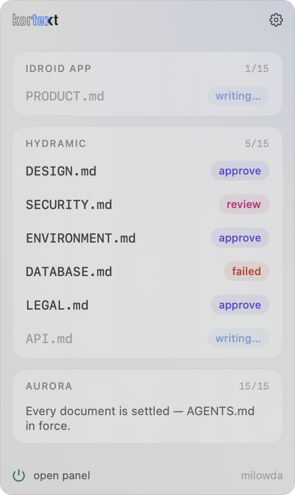

<p align="center">
  <picture>
    <source media="(prefers-color-scheme: dark)" srcset="docs/assets/kortext-logo-dark.svg">
    
  </picture>
</p>

<p align="center">
  <a href="https://www.npmjs.com/package/kortext"></a>
  <a href="https://github.com/erayendes/kortext/releases"></a>
  <a href="https://github.com/erayendes/kortext/actions/workflows/kortext-ci.yml"></a>
  
  <a href="LICENSE"></a>
  <a href="https://milowda.com"></a>
</p>

🇹🇷 [For Turkish press 1](docs/tr/README.md)

Building products with AI, I keep running into two problems.

1. I cannot see where the project stands.
2. At some point the model drifts from the rules we shook hands on and starts improvising like a free-range chicken.

I know you have the same problem. You just have not named it yet.

I have. Its name is **Kortext**.

Kortext is a product constitution you agree on with the AI before development starts — under whatever form of democracy you prefer.

From the **`BRIEF.md`** you provide, **10 expert personas** write **14 architecture documents**. That constitution is what keeps the model inside the project's reality.

Simple to use, thorough in what it covers.

- Enter the project and its scope in a refreshingly plain interface.

- Every document a persona writes is put in front of you for approval.

- Read them — for a smooth ride, or for an audit. A document may ask you questions; you may ask for an explanation or a change.

- If the change you ask for touches another document, that document goes back through the pipeline.

- Once the constitution is settled, carry on with whatever AI you use, however you like.

And I have not forgotten projects that are already under way: Kortext can start from an existing codebase too.

## For the more curious

There is one human role, **Prime**. The other personas: product manager, architect, designer, growth expert, security engineer, DevOps engineer, DBA, compliance expert, copywriter and QA engineer.

**BRIEF.md** is the document you provide. From it, Kortext produces `PRODUCT.md`, `STACK.md`, `STRUCTURE.md`, `ARCHITECTURE.md`, `DESIGN.md`, `GROWTH.md`, `SECURITY.md`, `ENVIRONMENT.md`, `DATABASE.md`, `API.md`, `LEGAL.md`, `CONTENT.md`, `ENGINEERING.md`, `TEST.md` — and, on request at the end, `EXPERIENCE.md`: the brief and prompts a design AI works from.

There is a sample `BRIEF.md`. If the brief you wrote is not enough, Kortext says so.

Add an existing project and it may come back with suggestions about where the project is and where it is heading. Smart-arse.

It runs your own AI agent.

It is not shy with tokens, but it spends them before the tokens and the hours that would otherwise be wasted later. On the whole, a much better deal.

Kortext collects nothing, keeps no telemetry. I am very curious how much it gets used, though.

## How it works

<p align="center">
  
</p>

1. Pick the project folder and the agent CLI it runs on. The choice belongs to the project; two projects can happily sit on two different CLIs. A *new project* starts from a brief you write or upload in the form; an *existing project* starts straight from the code.

2. Kortext puts a `.kortext/` folder at the root of the repo, with the document skeletons inside, and an `AGENTS.md` beside it. If `AGENTS.md` already exists, it adds a marked block and leaves your own text alone.

3. Kortext runs your agent CLI step by step, in the order the documents depend on each other. Each step writes one document — ARCHITECTURE, STACK, SECURITY, DATABASE, DESIGN, LEGAL… — as a persona: architect, security engineer, designer.
   Every document arrives as a `draft`, and a document you have not approved is never written.

4. Open any document. Approve it; select a line and ask "why did you write it this way?" (that conversation is ephemeral, nothing is saved); or leave notes and ask for a revision. Ask for a revision and the document is written again.

5. When every document is approved or declared unnecessary, the analysis is complete. The documents are now the project's constitution and `AGENTS.md` is the handover. Copy one of the starter commands into your client — CLI or app, whichever you use — and start building.

> A document can also close as `not-applicable`, with a reason: "this project does not need this one." That too is the author's judgement — you approve it like any draft.

## Install

**Node 22 or newer** and at least one agent CLI on your PATH is all you need
(`claude`, `codex`, `antigravity` or another).

After that it is one command in the terminal: `npm install -g kortext`

> npm no longer runs a package's install scripts on its own. Kortext's SQLite binding ships prebuilt for the common platforms, so this command is usually enough.
> If `kortext` starts but cannot open its database, install once more with the script allowed:

```sh
npm install -g --allow-scripts=better-sqlite3 kortext
```

When the install finishes, type `kortext`. The server comes up, your browser opens, and the Kortext panel is in front of you. That is all.

> The server uses port 3441; change it with `--port` if you like.
> Your data lives in one global SQLite database: `~/.kortext/kortext.db`. Change that with `--db`.

<details>
<summary><b>Requirements</b></summary>
<br/>

### Node.js `22` and npm `10`

<details>
<summary><b>Node 22 on macOS</b></summary>

```sh
brew install node@22
```
</details>

<details>
<summary><b>Node 22 on Windows</b></summary>

> **Windows support is experimental.** Kortext is developed and tested on macOS and Linux. The Windows-specific parts — finding your agent CLI with `where`, running the `.cmd` shim npm installs — were written from the documented behaviour but have not been run on a real Windows machine. If something does not work, please [open an issue](https://github.com/erayendes/kortext/issues); the fault is my gap, not your setup.

Install Node 22 from **nodejs.org** (the LTS labelled v22.x). On the *Tools for Native Modules* screen, tick **"Automatically install the necessary tools"**; Kortext's SQLite binding needs them.

`EACCES` or a permission error on the global install? Point npm's global folder at one you own instead of opening an admin shell:

```powershell
npm config set prefix "$env:APPDATA\npm"
```

and add `%APPDATA%\npm` to your `PATH`.
</details>

<details>
<summary><b>Linux</b></summary>

```sh
sudo apt install -y curl build-essential python3      # gcc/make for the SQLite binding
curl -o- https://raw.githubusercontent.com/nvm-sh/nvm/v0.40.3/install.sh | bash
nvm install 22 && nvm alias default 22
```

Do not `sudo npm install -g`. On `EACCES`:
`npm config set prefix ~/.npm-global`, then put `~/.npm-global/bin` on your `PATH`.
</details>

### An agent CLI

```sh
npm install -g @anthropic-ai/claude-code    # claude
npm install -g @openai/codex                # codex
npm install -g @google/gemini-cli           # gemini
```

> [!NOTE]
> You give Kortext no key; it uses the subscription behind the CLI you already use. Cursor, Copilot, OpenCode, Amp, Droid, Goose, Qwen Code and Cline have their definitions ready too.

</details>

## Starting and stopping

Once Kortext is running you can close the terminal window; it keeps running in the background.

To stop it, press the ⏻ button in the panel's status bar.

To start it again, type `kortext` once more.

```sh
kortext              # start in the background, open the panel
kortext --stop       # stop the background server
kortext --no-detach  # keep it in this terminal, Ctrl+C to stop
```

Neither the button nor `--stop` cuts a running step short; while one is in flight they ask you to wait. An analysis is never interrupted mid-write.

What the background server prints collects in `~/.kortext/kortext.db.log`.

## The menu bar app (macOS)

<p align="center">
  
</p>

Optional. `Kortext.zip` on the [latest release](https://github.com/erayendes/kortext/releases/latest) — notarized, updates itself. It needs kortext installed; it shows what waits on you, opens the panel on a document, starts and stops the server, and sends a notification when a document lands or a step fails. The panel offers it under the heading on a Mac that has none running.

To try what is not released yet: press **Try beta version** in the panel's status bar or the app's settings — or `npm i -g kortext@beta` by hand. **Use stable version** brings you back. The app follows the package's channel.

## Update and uninstall

When a new version is out, the panel says so in a blue strip under the heading — it checks when opened and then every hour. **Update now** runs the install for you, then offers **Quit**; the new version takes over once you start kortext again. If a step is running, the button waits for it rather than swapping the files underneath. By hand, or if the button fails:

```sh
npm update -g kortext
npm uninstall -g kortext
```

Uninstalling removes only the program. Your project registry and logs stay in `~/.kortext/`, and your documents stay in your repo. For a clean slate, delete both yourself.

## Development

```sh
npm install && npm --prefix ui install
npm run dev        # server :3441 (tsx watch)
npm run dev:web    # vite panel :3442 (proxy /api → 3441)
npm test           # node:test suite
npm run typecheck  # server + panel
npm run format     # prettier writes; format:check verifies (CI runs the check)
npm run build      # tsc → dist/ + vite → ui/dist/
```

For issues and pull requests — see [CONTRIBUTING](.github/CONTRIBUTING.md),
[SUPPORT](.github/SUPPORT.md) and the [security policy](.github/SECURITY.md).

Kortext is free and MIT-licensed. If it earns a place in your work,
[sponsoring it](https://buymeacoffee.com/erayendes) keeps it maintained.

## Docs

[GUIDE](docs/GUIDE.md) — the panel, explained · [CHANGELOG](docs/CHANGELOG.md)

## License

MIT © Eray Endes
