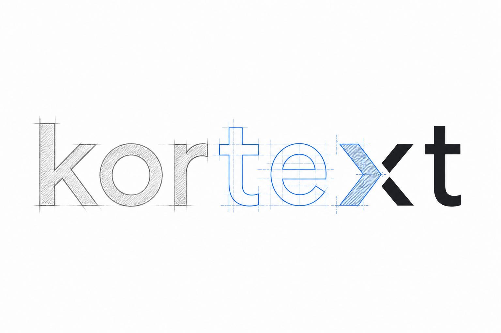
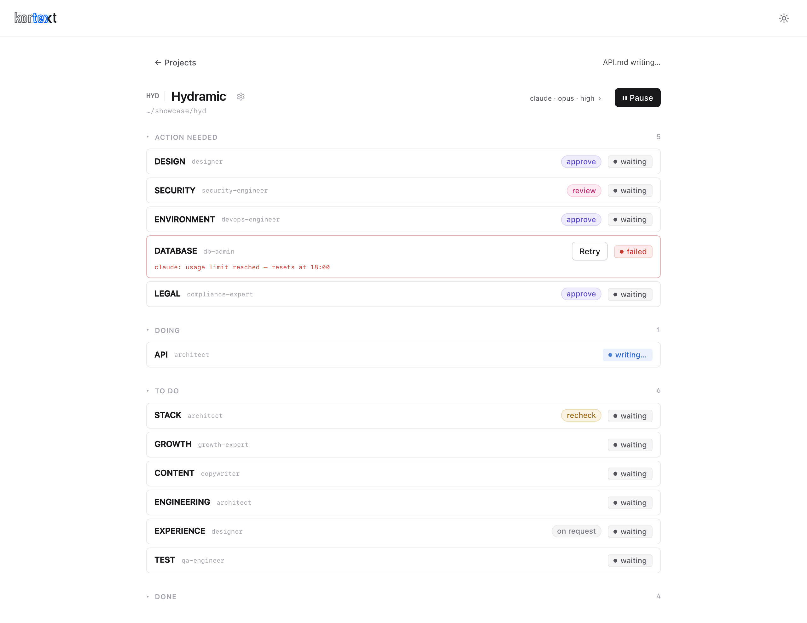

<p align="center">
  
</p>

<p align="center">
  <a href="https://www.npmjs.com/package/kortext"></a>
  <a href="https://github.com/erayendes/kortext/actions/workflows/kortext-ci.yml"></a>
  
  <a href="LICENSE"></a>
  <a href="https://milowda.com"></a>
</p>

**The project brain for AI-driven development.** Kortext turns a brief (or an
existing codebase) into an approved analysis foundation — and it drives your
own coding agent (Claude Code, Codex, Gemini CLI…) to write it. You never
leave the panel during analysis: documents land as drafts, you approve,
annotate, or request revisions, and the chain advances on your approvals.
When every document is settled, Kortext retires — the docs become the
project's guideline and `AGENTS.md` hands your agent the contract.

Kortext holds no API key and calls no LLM API of its own — it spawns the
agent CLI you already have installed and pay for, headlessly, inside your
repo.

<p align="center">
  
</p>

## How it works

1. **Add a project.** Pick the repo folder and the agent CLI it runs on — the
   choice belongs to the project, so two projects can sit on two different
   CLIs. *New project* starts from a brief (BRD) you write or upload in the
   form; *existing project* starts straight from the code. Kortext scaffolds
   `AGENTS.md` at the repo root and `.kortext/` with document skeletons.
2. **Analysis.** Kortext runs your agent CLI step by step through a
   dependency-gated workflow. Each step writes one document
   (ARCHITECTURE, STACK, SECURITY, DATABASE, DESIGN, LEGAL, …) as a persona
   (architect, security-engineer, …) and lands it as `draft`.
   A document whose inputs you haven't approved is never written. Up to
   three independent steps run in parallel; your approval wakes the chain.
3. **Review in the panel.** Open any document: approve it, select a line and
   ask the author persona about it (ephemeral Q&A — nothing is saved), or
   drop notes and request a revision (the producing step re-runs with your
   notes). A document can also settle as `not-applicable` with reasoning.
4. **Handshake.** When every document is approved or not-applicable, analysis
   is complete. The docs are now the project's sacred guideline; `AGENTS.md`
   is the handover constitution. Copy one of the starter commands into your
   client (CLI or app) and build.

## Requirements

| | minimum | why |
| --- | --- | --- |
| **Node.js** | 22 | the runtime |
| **npm** | 10 | ships with Node 22 |
| **An agent CLI** | one of the three below | the engine Kortext drives |

Kortext holds no key: it spends the subscription behind the CLI you already use. Install
whichever one that is — the three are equal as far as Kortext is concerned, and it picks up any
of them from your `PATH`. Git is not required.

```sh
npm install -g @anthropic-ai/claude-code    # claude
npm install -g @openai/codex                # codex
npm install -g @google/gemini-cli           # gemini
```

## Install

```sh
npm install -g kortext
```

Node 22 itself, per platform:

<details>
<summary><b>macOS</b></summary>

```sh
brew install node@22
```

Juggling Node versions? `brew install fnm && fnm install 22 && fnm default 22`.
</details>

<details>
<summary><b>Windows</b></summary>

Install Node 22 from **nodejs.org** (the LTS labelled v22.x). On the *Tools for Native Modules*
screen, tick **"Automatically install the necessary tools"** — Kortext's SQLite binding needs
them.

`EACCES` or a permission error on a global install? Point npm's global prefix at a folder you
own instead of using an admin shell:

```powershell
npm config set prefix "$env:APPDATA\npm"
```

and add `%APPDATA%\npm` to your `PATH`.
</details>

<details>
<summary><b>Linux</b></summary>

```sh
sudo apt install -y curl build-essential python3      # gcc/make for the SQLite binding
curl -o- https://raw.githubusercontent.com/nvm-sh/nvm/v0.40.3/install.sh | bash
nvm install 22 && nvm alias default 22
```

Never `sudo npm install -g`. On `EACCES`:
`npm config set prefix ~/.npm-global` and put `~/.npm-global/bin` on your `PATH`.
</details>

## Quick start

Requires **Node ≥ 22** and at least one agent CLI on your PATH
(`claude`, `codex`, or `gemini`).

```sh
npm install -g kortext
kortext
```

The server starts on port **3441** (`--port` to change) and opens the panel.
Data lives in one global SQLite database at `~/.kortext/kortext.db`
(`--db` to change); the documents live in your repo.

## What lands in your repo

```
AGENTS.md                  the agent's entry contract (handover constitution)
.kortext/
  ARCHITECTURE.md STACK.md STRUCTURE.md API.md DATABASE.md SECURITY.md
  DESIGN.md TEST.md LEGAL.md GROWTH.md CONTENT.md ENVIRONMENT.md
  foundation/              frozen starting docs: BRD, PRD, TRD, PFD
```

Frontmatter `status` is the source of truth:
`uninitialized → draft → approved` (or `not-applicable`).

## Check it works

```sh
node --version                          # v22 or newer
kortext --version
which claude || which codex || which gemini
```

An installed CLI is not necessarily a signed-in one: run yours once on its own before pointing
Kortext at a real project. The CLI is chosen per project, in the Add project form; a project
screen carries the same dropdown next to Start, so you can switch when a quota runs out. With
none installed, the panel says so in its header.

## Update and uninstall

```sh
npm update -g kortext
npm uninstall -g kortext
```

Uninstalling removes the binary only. The registry and logs stay in `~/.kortext/`, and every
document stays in your repo — delete either yourself if you want a clean slate.

## Development

```sh
npm install && npm --prefix ui install
npm run dev        # server :3441 (tsx watch)
npm run dev:web    # vite panel :3442 (proxy /api → 3441)
npm test           # node:test suite
npm run typecheck  # server + panel
npm run format     # prettier writes; format:check verifies (CI runs the check)
npm run build      # tsc → dist/ + vite → ui/dist/
```

Issues and pull requests are welcome — see [CONTRIBUTING](.github/CONTRIBUTING.md),
[SUPPORT](.github/SUPPORT.md) and the [security policy](.github/SECURITY.md).

## Docs

[Guide](docs/GUIDE.md) — the panel, explained · [Changelog](docs/CHANGELOG.md)

## License

MIT © Eray Endes
