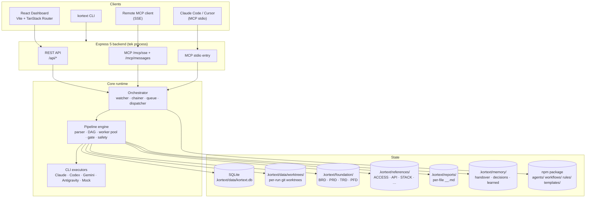
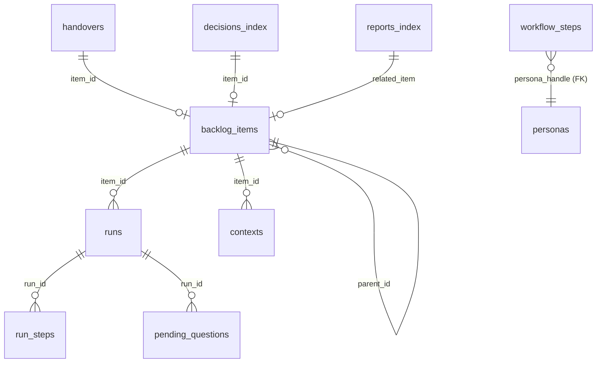
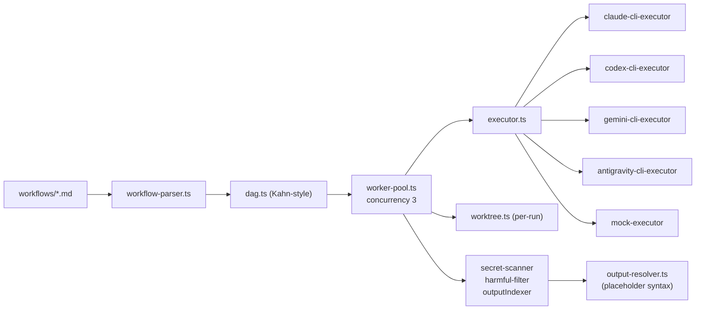
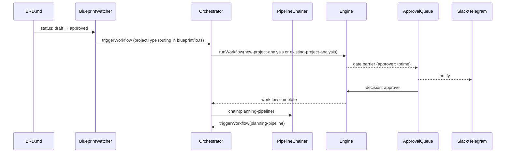
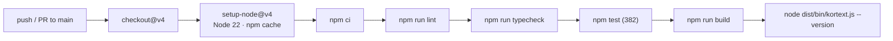

# Kortext v3.1 — Architecture

Bu dosya Kortext'in runtime mimarisinin **kanonik** referansı. Geliştirici / katkıda bulunan / entegrasyon yapan AI ajanları için. Son-kullanıcı için [USER-GUIDE.md](../USER-GUIDE.md), kararların gerekçesi için [DECISIONS.md](./DECISIONS.md).

---

## 1. Tek satır özet

> **Markdown insan kaynakları + SQLite engine state + git worktree per-task + 14 persona + 12 workflow + MCP + React dashboard.** Blueprint approved → analysis → planning → development → test → deploy zinciri otonom çalışır. Kritik gate'ler `pending_questions`'a düşer, dashboard inbox üzerinden +prime onaylar.

---

## 2. Katmanlar



Tek Node process. MCP stdio ayrı process (her host CLI bir tane); factory + dependencies paylaşılır, transport ayrıdır.

---

## 3. Dosya disiplini (v3.1)

### 3.1 npm paketi (`node_modules/kortext/`)

```
kortext/                      ← paket dizini (dot YOK)
├── agents/*.md               14 persona — AI'ın anayasası
├── workflows/*.md            12 workflow — pipeline tanımları
├── rules/*.md                6 rule (behavior/branching/commands/emergency/mcp/models)
├── templates/                init seed (bir kez kopyalanır)
│   ├── AGENTS.md
│   ├── .env.example
│   ├── .gitignore
│   ├── foundation/{BRD,PRD,TRD,PFD}.md
│   ├── backlogs/{BXX,DXX,EXX,HXX,SXX,TXX}-*.md
│   ├── memory/{handover,decisions,learned}.md
│   ├── references/{ACCESS,API,CONTENT,DATABASE,DESIGN,ENVIRONMENT,GLOSSARY,GROWTH,LEGAL,SECURITY,STACK,STRUCTURE,TEST}.md
│   └── reports/{content,delivery,growth,legal,release-notes,security,status,test}-reports.md
├── bin/                      CLI entry
├── dist/                     derlenmiş TS → JS + frontend bundle
└── README.md / CHANGELOG.md / USER-GUIDE.md / LICENSE
```

**Persona / workflow / rule definitions hiçbir zaman proje köküne kopyalanmaz** — `node_modules/kortext/`'ten okunur. `kortext init` sadece `templates/` içeriğini kopyalar.

### 3.2 Kullanıcı projesi (kortext init sonrası)

```
acme-crm/                          ← proje
├── AGENTS.md                      AI tool discovery
├── .env                           secret değerler (git-ignored)
├── .env.example                   template'ten kopya
├── .gitignore                     `.kortext/data/` ignore
└── .kortext/
    ├── data/                      SQLite + worktree + log (git-ignored)
    │   ├── kortext.db
    │   ├── worktrees/run-<id>/
    │   ├── worktrees-quarantine/
    │   └── logs/
    ├── foundation/                analysis turunun donmuş çıktıları
    │   ├── BRD.md                 Business Requirements (blueprint)
    │   ├── PRD.md                 Product Requirements
    │   ├── TRD.md                 Technical Requirements
    │   └── PFD.md                 Product Foundation (konsolide analiz raporu)
    ├── references/                canlı kaynaklar (ALL-CAPS)
    │   └── ACCESS / API / CONTENT / DATABASE / DESIGN / ENVIRONMENT /
    │       GLOSSARY / GROWTH / LEGAL / SECURITY / STACK / STRUCTURE / TEST
    ├── reports/                   per-file rapor (`<scope>_<slug>_<ts>.md`)
    └── memory/
        ├── handover.md            canlı (latest); rotation: 5 entry veya 30 KB
        ├── handover-<YYYY-MM-DD-HHMM>.md  arşivlenen turlar
        ├── decisions.md           tek dosya, TOC'lu (engine auto-update)
        └── learned.md             tek dosya, TOC'lu (asla arşivlenmez)
```

### 3.3 Foundation vs References ayrımı

| Foundation (donmuş) | References (canlı) |
|---|---|
| Bir kez üretilir (analysis turunda), sonra overwrite (re-analysis'te) | Proje boyunca güncellenir |
| ALL-CAPS kısaltma (BRD/PRD/TRD/PFD) | ALL-CAPS tam (ACCESS/STACK/SECURITY/...) |
| Sonraki workflow'lar input olarak okur | Tüm workflow'lar input/output |
| Post-analysis re-read disipline'inde | Continuously edited |

---

## 4. Data layer (markdown + SQLite hibrit)

### Karar prensibi

> **Markdown = "okumak / düşünmek için." SQL = "saymak / aramak / sıralamak için."**

| Veri | Yer | Format | Sebep |
|---|---|---|---|
| Persona / workflow / rule | npm package | Markdown | AI'ın yasası |
| Init template'leri | `templates/` | Markdown | Bir kez kopyalanır |
| Foundation (BRD/PRD/TRD/PFD) | `.kortext/foundation/` | Markdown | AI + insan okur |
| References | `.kortext/references/` | Markdown | Takım sürekli düzenler |
| Reports (per-file) | `.kortext/reports/` | Markdown + SQL index | Filter/sıralama dashboard |
| Memory | `.kortext/memory/` | Markdown | Karar + akış kaydı |
| Engine state (run/step/context/lock/audit) | `.kortext/data/kortext.db` | SQL | Sorgu + transaction |
| Backlog item | `.kortext/data/kortext.db` (`backlog_items`) | SQL kolon + `body_md` | Hibrit |
| Workflow/persona SQL index | `.kortext/data/kortext.db` | SQL | Parse-time FK validation |

### SQLite şema (özet)



**Migrations** (`server/db/migrations/`):
- `001_init.sql` — temel schema
- `002_add_test_status.sql` — backlog_items status'a `test` ekleme (additive)
- `003_add_reports_index.sql` — per-file rapor index'i
- `004_add_workflow_persona_index.sql` — workflow_steps + personas FK

**Disipline:**
- Tüm timestamp `INTEGER` Unix ms — `new Date(ms)`
- Tüm JSON kolonları `TEXT` + `json1` — `server/db/json.ts` helpers
- WAL mode (dashboard 3s poll + engine concurrent step writes)
- `PRAGMA foreign_keys = ON`

---

## 5. Engine



### Workflow parser

Pattern (Faz 12.8 + Faz 13):
- `# H1 Title` → workflow title
- `## Phase` → phase grouping (key: `<slug>.N`)
- `N. **+persona-handle:** description` → step (parser PERSONA_RE = `^\*\*(\+[\w-]+):\*\*\s*(.*)$`)
- Sub-bullet: `- inputs:`, `- outputs:`, `- approver:`, `- reviewer:`
- Path normalize: parser tek leading `../` strip eder
- Output placeholder syntax: `<slug>` ve `<ts>` filename'de — engine runtime'da resolve eder
- **Gate detection: `step.approver === '+prime'` → otomatik gate üretilir** (callout YOK — Faz 13 değişikliği)

### DAG construction

`inputs[]` ↔ `outputs[]` eşleşmesi — bir step'in inputs'unu daha erken bir step'in outputs'u üretiyorsa bağımlılık kurulur. Hiçbir step üretmiyorsa `externalInputs` (gate-enforcer kontrol eder). Kahn-style topological sort + cycle detection.

### Worker pool

Pull-ready scheduler:
1. Ready set = zero-dep nodes
2. `concurrency` worker spawn (default 3)
3. Her worker bir ready step çeker, executor'a verir
4. İlk `failed` → AbortController → kalan steps `skipped`
5. Gates: `gateController.pauseAtGate` barrier; resume kararla devam

### Gate enforcement

İki tür:
- **Pre-gate** — `externalInputs` frontmatter `status: approved` zorunluluğu
- **Mid-run barrier** — step `approver: +prime` ise auto-gate

Reject → run `cancelled` + `error_message: rejected: <reason>` + worktree quarantine.

### Per-run worktree

`git worktree add .kortext/data/worktrees/run-<id>` + branch `kortext/run-<id>`. Success → opt-in merge + remove. Failure → quarantine + branch korunur. `kortext cleanup --quarantine-older-than=Nd --branches` yaşlanmış olanları siler.

### Output safety + placeholder syntax (Faz 13)

`output-resolver.ts`:
- Static path → existence check
- Patterned path (`<slug>_<ts>`) → directory scan + regex match (`[a-z0-9][a-z0-9-]*_\d{4}-\d{2}-\d{2}-\d{4}\.md`)

Her başarılı step sonrası:
- **Secret scanner** — 4 pattern grup + allow-list (`process.env`, `YOUR_…`, `PLACEHOLDER`, `.env*`)
- **Harmful-output filter** — banned-phrase list (v3.0 placeholder)
- **outputIndexer** — per-file report match → `reports_index` SQL'e otomatik insert (server boot'unda wire'lı)

---

## 6. Orchestrator



- **Pipeline chainer:** `nextWorkflowId` → bir sonraki run
- **Approval queue:** `pending_questions` + 3 REST endpoint + MCP eşdeğeri
- **Notification dispatcher:** Slack + Telegram fan-out, dedup `(channel, kind, resource_id)`
- **Resume:** boot'ta `runs.status: running` → `cancelled (orphaned)`; `retryRun` orphaned'leri kaldığı gate'ten
- **v3.1 item-lifecycle engine (§5.9 — mock-first, capstone Madde 10 bekliyor):** workflow-run engine'in yanına paralel **item-seviyesi yaşam döngüsü** katmanı: `item-lifecycle` (durum geçişleri: to_do→in_progress→test→review→done, +bounce/block/cancel) + orchestrator fold'ları — `test-cycle` (gate fan-out/join), `review-cycle` (uat), `closure` (merge→done), `epic-completion` (→staging), `block` (→cancel), `whose-turn` (board göstergesi), `test-preview` (local URL). **Koşullu mantık orchestrator katmanında düz TS** (DB durumu üzerinde fold); DAG saf AND-join kalır → §5.12 deadlock yapısal olarak imkânsız (karar §5.13). Beş mock-first arayüz (`gate-executor`/`review-approver`/`merger`/`deployer`/`preview-server`) + `run-registry` capstone'da (Madde 10) gerçeğe bağlanır; şu an üretimden sürülmüyor (blast-radius sıfır, yalnız testler çağırıyor).

---

## 7. MCP server

- **Factory + injectable deps** — test/stdio/SSE aynı factory
- **SSE per-session McpServer** — handler state transport'a kilitli; `transports` map sessionId → transport
- **Stdio console patch** — stdout = JSONRPC; `console.log → console.error` monkey-patch
- **Tool envelope** — `{ content: [{type:'text', text: JSON.stringify(...)}], structuredContent }`

15 tool: workflow (5), backlog (3), approval (2), context (3), blueprint (2), health (1).

---

## 8. Dashboard

- **Hash history** — Express SPA fallback gerekmiyor
- **Tailwind v4 `@theme inline` + CSS variables** — palette tek kaynak
- **API type mirror** (`src/lib/api-types.ts`) — frontend bundle better-sqlite3'ü çekmesin
- **`/api/docs/:scope` allow-list** — `foundation | references | reports | memory | rules | workflows`
- **Marked + DOMPurify** — XSS koruma
- **Tek polling source** — `PendingQuestionsProvider`

Visual spec: [concepts/wireframe-v4-final.html](./concepts/wireframe-v4-final.html). Tasarım sistemi: [DESIGN.md](./DESIGN.md).

---

## 9. CLI

> **v3.1 CLI redesign uyarısı:** Aşağıdaki komut listesi **v3.0 production** durumudur. v3.1'de CLI yüzeyi yeniden tasarlanacak (multi-project daemon + 9 komutluk konsolide arayüz: `start/stop/pause/list/remove/purge/update/doctor/help`). Yön kararı: [DECISIONS.md Bölüm 0](./DECISIONS.md). v3.1 implementation tamamlanana kadar bu bölüm canlıdır.

```
bin/kortext.js (dual-mode shim)
  ├── dist/bin/kortext.js → in-process import (fast)
  └── otherwise          → spawn `tsx bin/kortext.ts` (dev)

bin/kortext.ts
  ├── --version / --help
  ├── init    → scaffold
  ├── serve   → backend + dashboard
  ├── start   → workflow
  ├── approve → pending question
  ├── status  → recent runs
  ├── logs    → audit log
  ├── cleanup → worktree quarantine
  ├── doctor  → consistency
  ├── archive → handover rotation
  └── mcp     → stdio MCP
```

`server/cli/` modülleri **pure** — hiç `console.*` yok. Bin layer formatlama + stdout/stderr.

---

## 10. Frontmatter standartları (v3.1 spec §5)

| Tür | Standart |
|---|---|
| References (file-level, kanonik) | `status, author, reviewer, approver` |
| Reports (file-level, kayıt) | `status, author, reviewer, updated_at` |
| Handover (entry-level) | her `## Handover: <id>` block kendi frontmatter'ı: `status, author, updated_at` (approver yok, `to` opsiyonel) |
| ADR (`decisions.md`) + Learned (`learned.md`) | Section-level header pattern + TOC otomatik (engine `markdown-sync.writeDecision/writeLearned` → `toc-updater`) |

INFO callout (`> [!INFO]`) **kaldırıldı** — tek YAML frontmatter standardı.

---

## 11. TOC + selective read

Engine `markdown-sync.writeDecision` + `writeLearned` sonunda `toc-updater.updateToc()` (opt-in: dosyada `## İçindekiler` heading varsa). Atomik tutarlılık.

Selective read pattern (büyük dosyalar için):
```
1. Read(file, offset=0, limit=30)       → TOC
2. Grep("^## <Section>", file)          → satır no
3. Read(file, offset=N, limit=M)        → o bölüm
```

5× token tasarrufu + prompt cache invalidation azalır.

---

## 12. Prompt cache disipline

`claude-cli-executor.ts`:
- Persona body → `--append-system-prompt` (stable prefix)
- Per-step runtime data (runId, stepId, timestamp) → user message
- `--exclude-dynamic-system-prompt-sections` → kullanıcının `~/.claude/settings.json` dynamic prompts skip

AGY / Codex / Gemini için `--system-prompt` analog yok — stable-prefix disipline'ı dokümante edildi (`tests/cli-executor.test.ts` byte-equality garantisi).

---

## 13. CI



`cancel-in-progress: true` — superseded run iptal.

---

## 14. Codebase haritası

| Konu | Dosya |
|---|---|
| Schema | `server/db/migrations/*.sql` |
| DB client | `server/db/client.ts` |
| Repositories | `server/db/repositories/*.ts` |
| Paths layout | `server/paths.ts` |
| Workflow parser | `server/engine/workflow-parser.ts` |
| DAG | `server/engine/dag.ts` |
| Worker pool | `server/engine/worker-pool.ts` |
| Worktree | `server/engine/worktree.ts` |
| Gate enforcer | `server/engine/gate-enforcer.ts` |
| Output resolver | `server/engine/output-resolver.ts` |
| Index sync | `server/engine/index-sync.ts` |
| Item lifecycle (§5.9) | `server/engine/item-lifecycle.ts` |
| Lifecycle mock-first seams (§5.9) | `server/engine/{gate-executor,review-approver,merger,deployer,preview-server,run-registry}.ts` + `executors/mock-*.ts` |
| Output safety | `server/safety/{secret-scanner,harmful-output-filter}.ts` |
| Orchestrator | `server/orchestrator/{orchestrator,blueprint-watcher,pipeline-chainer,approval-queue,resume}.ts` |
| Lifecycle orchestrator (§5.9) | `server/orchestrator/{test-cycle,review-cycle,closure,epic-completion,block,whose-turn,test-preview}.ts` |
| Notifications | `server/notifications/{dispatcher,slack,telegram}.ts` |
| Services | `server/services/{markdown-sync,toc-updater,handover-rotation}.ts` |
| Blueprint IO | `server/blueprint/io.ts` |
| MCP factory | `mcp/server.ts` |
| MCP stdio | `mcp/stdio.ts` |
| MCP SSE | `mcp/sse.ts` |
| CLI | `bin/kortext.ts`, `bin/kortext.js` |
| Dashboard | `src/router.tsx`, `src/routes/*`, `src/components/*` |

---

## 15. v2 archive references

v3 öncesi v2 (Python + Bash) implementasyonu kaldırıldı ama git geçmişinde tutuluyor:

| Ne | Erişim |
|---|---|
| v2 final state (Türkçe) | tag `tr-archive` (commit `942a83c`) |
| v2 original main | tag `v2-original` (commit `0594741`) |
| v2 English translation | branch `en` (tag `en-archive`) |
| WIP refactor (terkedilmiş) | branch `wip/v2-refactor` |

Karakterizasyon testleri pin edilene kadar `legacy/` altında referans olarak duruyor.

---

## 16. Known gotchas / footguns

Kortext kod tabanında geliştirici ısırılan runtime quirks. Yeni katkı yapan / refactor eden için zorunlu pre-flight.

- **PreToolUse Write hook string-match yanlış pozitif:** regex'lerde `.match()` API, batch SQL alias, `cp.<name>` ile sync spawn — string-match hook'larını yanlış tetikler, maskele.
- **HTML inject + sanitize:** `MarkdownViewer` marked + DOMPurify ile sanitize ediyor; **doğrudan HTML inject yasak** (XSS riski).
- **TanStack Router HMR:** route değişikliğinde full reload gerekli (`Cmd+Shift+R`) — router instance reset için.
- **MCP stdio'da `console.log` ölümcül:** stdout = JSONRPC kanalı; `bin/kortext.ts mcp` modunda **ilk iş** `console.log = console.error` monkey-patch.
- **Foreign key sırası:** `runs.item_id → backlog_items.id`; önce backlog item insert, sonra run.
- **Hash router:** derin link formatı `http://localhost:5173/#/board` (history mode değil).
- **Worktree quarantine branch'leri:** failure sonrası `kortext/run-<id>` branch'i postmortem için korunur — manuel cleanup gerekir.
- **Frontend bundle tip mirror:** `src/lib/api-types.ts` server tipini elden mirror ediyor; schema değişikliğinde **iki yer** güncellenmeli.
- **`serve` child cwd ≠ kortext kaynak dizini:** prod modda Express `dist/web`'i kendi serve eder (Node 26 spawn race önlemek için).
