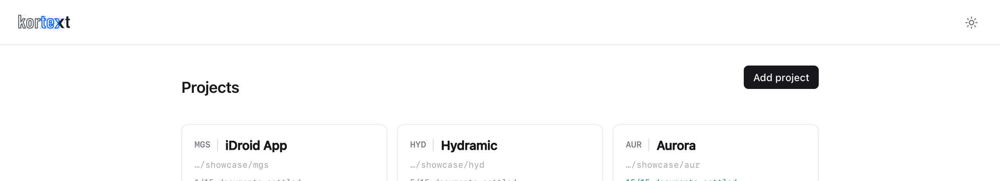
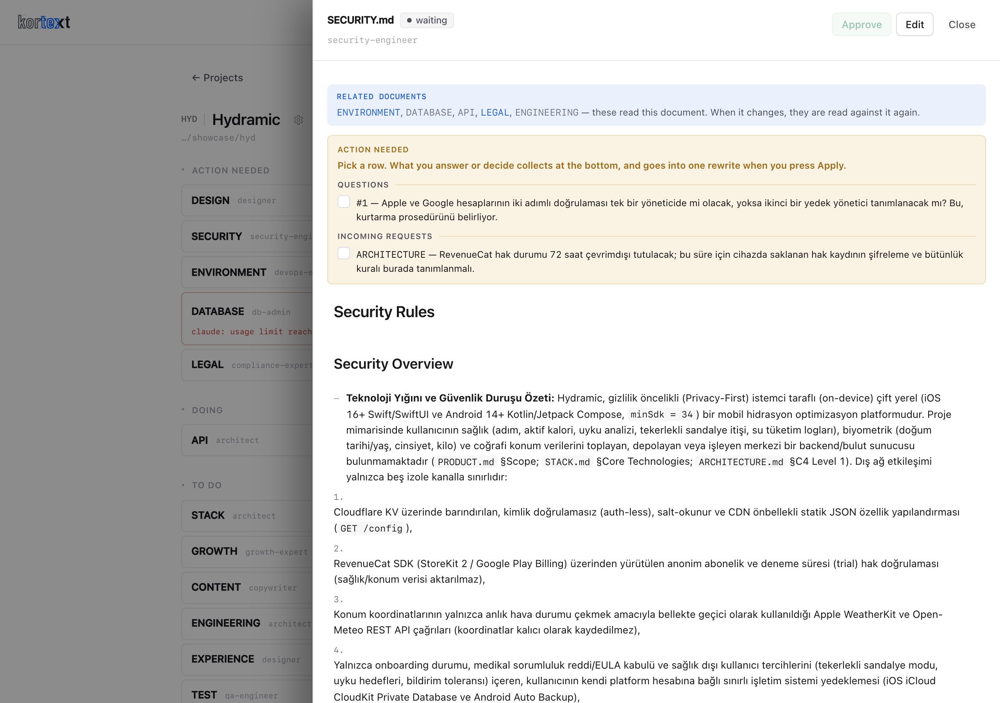
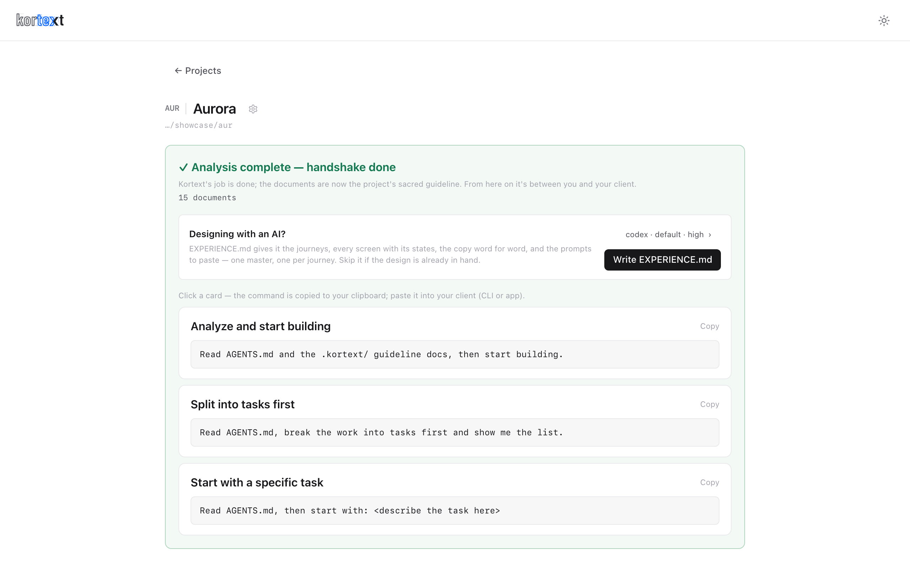

# Kortext — Guide

The panel, explained. Installation and the five-step overview are in the
[README](../README.md); this is what to do once a project is on screen.

---

## The mental model

Kortext writes nothing itself. It runs **your** agent CLI, one step at a time, inside your repo,
and each step produces exactly one document. You are the only approver: a document nobody
approved is never used as the ground for the next one.

Three things follow from that.

- **Every document has a status.** `waiting` (its turn has not come) → `writing` (your CLI is
  producing it now) → `pending` (written, waiting for you) → `approved`. A document can also
  settle as `n/a` — the step read the inputs and judged that this project does not need it, and
  said why.
- **The order is not a preference.** A document is written only after everything it depends on
  is settled. That is why `SECURITY` waits for `ARCHITECTURE`, and why approving one document
  often starts three others at once.
- **The panel is the only place you work.** Nothing needs a terminal after `kortext`.

## Starting: the gate

Press **Start** and Kortext reads your evidence before it spends anything.

A **new project** is judged on its brief. If the brief does not say what you are building, who
it is for, which language the product speaks, how you will know it worked, and what is out of
scope, the analysis does not begin — you get those questions back, in the language you wrote in,
and the brief moves to **Needs you**. Answer them in the brief, approve it again, press Start.

An **existing project** is judged on its code: a folder with almost nothing in it has nothing to
analyse.

This gate exists for one reason. An agent asked to write a product requirements document from
three sentences will write one — it will simply invent the product. A question costs you a
minute; an invented product costs you the whole analysis.

## Reviewing a document

Open any document from the list. Everything happens in the drawer.

**Approve** — the document becomes ground for the ones after it, and the chain moves on.

**Ask** — select a line, ask its author. The persona that wrote the document answers about that
passage. Nothing is saved: this is for understanding what you are approving, not for changing it.

**Add note → Request revision** — your notes go back to the step that wrote the document, and it
is rewritten with them. A note left on one of the document's own open questions is read as the
answer to it: the question disappears and the fact it established becomes part of the text.

**Edit** — write the file yourself. Saving it settles whatever the drawer was asking about.

**Open questions** — amber, numbered. The document is asking *you* something, and it cannot be
approved until you answer.

**Change requests** — pink. Another document found a problem in this one: `ENVIRONMENT` says the
access-log lines contradict the no-logs decision, say. Two moves: **Apply** (the author rewrites
the document with that demand) or **Dismiss** with your reason. Both are recorded inside the
document that raised it, ticked, with the outcome written underneath — so the record lives where
the demand was made, and every agent that opens the file later sees it.

You can settle a demand from either end: from the document that received it, or from the one
that sent it.

**Dependent** — hollow pink. This document is approved, but something it reads is moving. Not
work for you; when that input settles, this one is re-read against it and you are told only if
something actually broke.

## The groups

`Needs you` · `In progress` · `Next` · `Approved` · `Not applicable`. The last two are collapsed
— one is finished, the other was deliberately skipped.

Anything carrying a failure or an open demand climbs to **Needs you** no matter what its status
says. The one exception is `dependent`, which is news, not a task.

## Running, pausing, changing the engine

The engine — `claude`, `codex` or `gemini` — belongs to the project, not to Kortext. You pick it
when you add the project, and the dropdown next to Start changes it later. That is the move when
a quota runs out: switch, and the steps that start afterwards run on the other CLI. Whatever is
running at that moment finishes on the old one.

Two projects can sit on two different CLIs, and neither disturbs the other. If you uninstall the
one a project was using, that project does not stop — it falls back to whichever CLI is still
installed, and the dropdown shows you what it fell back to.

- **Pause** stops new steps from starting; a running step is stopped too.
- **Continue** picks the chain back up.
- **Restart** wipes `.kortext/` and starts the analysis over, from the same brief.
- **Archive** puts a finished project on a shelf. The row stays, the repo is untouched.
- **Cancel** removes what Kortext wrote — `.kortext/`, its block in `AGENTS.md`, its pointer
  line in `CLAUDE.md`, and the project's logs — and unregisters the project. Anything you wrote
  yourself stays.

## The handshake

When every document is approved or `n/a`, with nothing left open, the analysis is complete and
Kortext is done. The completion card gives you three starter commands; copy one into your own
agent — CLI or app — and it begins by reading `AGENTS.md` and the `.kortext/` documents.

From here Kortext is not in the loop. The documents are the contract, and your agent works
against them.

## When something goes wrong

**A step failed.** The row says why, in the CLI's own words. The usual cause is an agent CLI that
is installed but not signed in — run it once on its own in a terminal, then Retry.

**The header says no agent CLI was found.** None of `claude`, `codex`, `gemini` is on your
`PATH`. Install one (see the [README](../README.md)) and reload.

**A step has been running for a long time.** Steps take minutes; a stuck one is stopped at
fifteen. The raw output of every run is in `~/.kortext/logs/`, one file per document.

**Kortext restarted while a step was running.** That step is marked failed with "kortext
restarted mid-step — retry", which is exactly what to do.

**A document will not leave "Needs you".** It is carrying an open question or an unanswered
demand. Both are shown in the drawer, and both need a decision from you — approving is blocked
until then, on purpose.

**Your changes on disk do not show.** The panel polls every few seconds; give it a moment.

## Where things live

| | |
| --- | --- |
| `~/.kortext/kortext.db` | the project registry — one database, every project |
| `~/.kortext/logs/` | raw output of every CLI run |
| `<repo>/AGENTS.md` | the handover contract, inside a marked block |
| `<repo>/.kortext/` | the documents, and `foundation/` for BRD · PRD · TRD · PFD |

The documents are plain markdown in your repository. Commit them: they are the project's
memory, and the next agent that opens the repo reads them before it writes a line.
