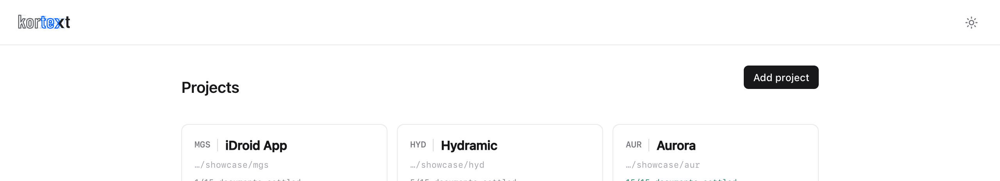
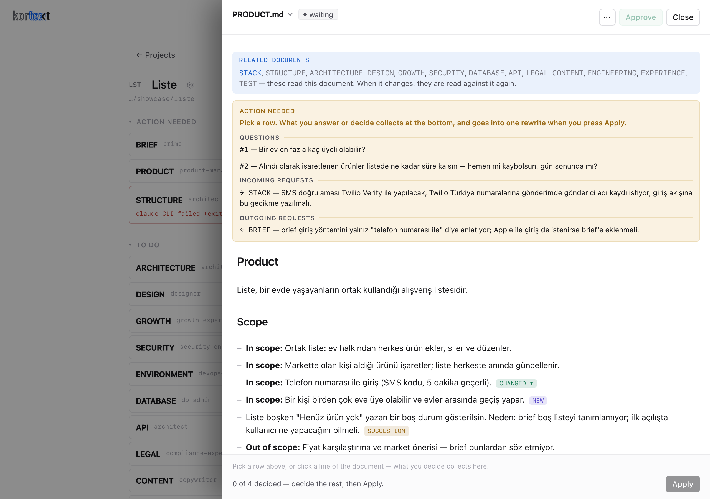
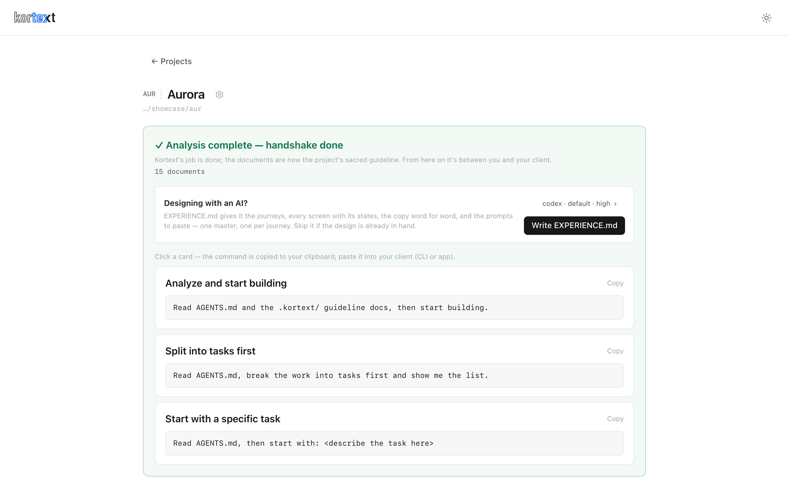

# Kortext — Guide

🇹🇷 [For Turkish press 1](tr/GUIDE.md)

The overview is in the [README](../README.md), installing in [INSTALL](INSTALL.md), the menu bar app in [MACOS](MACOS.md); this page is what to do once a project has been added.

## Starting and stopping

To start Kortext, type `kortext` in the terminal. Once it is running you can close the terminal window; Kortext keeps running in the background.
To stop the server, press ⏻ in the panel's status bar. It will not stop while a document is being written.

To start it again, type `kortext` once more.
What the background server prints collects in `~/.kortext/kortext.db.log`.

```sh
kortext              # start in the background, open the panel
kortext --stop       # stop the background server
```

> [!TIP]
> Neither the button nor `--stop` cuts a running step short; while one is in flight they ask you to wait. An analysis is never interrupted mid-write.

## Starting



The panel will guide you.

Give the project a name and the code you want for it, then pick the folder the new project will be written into — or the folder your existing project lives in.
If you are adding Kortext to an existing project, pick the model you want to run and start.
For a new project it will wait for a brief.

> [!IMPORTANT]
> If the brief does not say what is being built, who it is for, which language the product speaks, how you will know it worked, and what is out of scope, the analysis does not begin — questions come back and the brief drops to **Action needed**. Answer them in the brief and approve it. It is judged again.
> **This gate exists for one reason.** An agent asked to write a product requirements document from three sentences will write one — it will simply invent the product. A question costs a minute; an invented product costs the whole analysis.

### If you already have something

Anything already decided — a design you like, the technology you will use, a domain you own, a regulation you must meet, a thing you will never do — goes in the brief. The brief is every document's input; nothing in it gets reinvented, and everything not in it is the agent's call.

- **Design:** put the screens, exports, token file or `.pen` file in a folder in the repo (`design/`, say) and say so in the brief: *"The design is done; `design/` is the reference. No new design."* `DESIGN.md` documents that design and invents nothing beside it. If what you like is a website, there is no file; write the address and what you like about it — the spacing, the typeface, the dark ground. The agent cannot browse it; it applies your description.
- **Technology:** *"Next.js and Sanity, not up for discussion."* — `STACK.md` does not weigh options, it records the decision.
- **A rule or a limit:** *"No cookies, no forms, e-mail only."* — `LEGAL.md`, `SECURITY.md` and `GROWTH.md` take it as given.
- **Out of scope:** the brief has a section for it; write it there. What is not written is in scope.

Short is enough; one sentence closes one question. Every decision the brief leaves out comes back as a question from the first document on.

Kortext puts a `.kortext/` folder at the root of the repo, with the document skeletons inside, and an `AGENTS.md` beside it. If `AGENTS.md` already exists, it adds a marked block and leaves your own text alone.

Kortext works step by step, in the order the documents depend on each other. Each step writes one document — `PRODUCT.md`, `STACK.md`, `STRUCTURE.md`, `ARCHITECTURE.md`, `DESIGN.md`, `GROWTH.md`, `SECURITY.md`, `ENVIRONMENT.md`, `DATABASE.md`, `API.md`, `LEGAL.md`, `CONTENT.md`, `ENGINEERING.md`, `TEST.md`, `EXPERIENCE.md` — as a persona: `product manager`, `architect`, `designer`, `growth expert`, `security engineer`, `DevOps engineer`, `DBA`, `compliance expert`, `copywriter` and `QA engineer`.

> A document can be proposed as `not-applicable`, with the reason "this project does not need this one."

Every document written is put in front of you for approval.

Open any document. Approve it; select a line and ask "why did you write it this way?" (that conversation is ephemeral, nothing is saved); or leave notes and ask for a revision. Ask for a revision and the document is written again.

A document can ask for a change in a document written before it, or leave a note for one to be written after it. Those, too, wait for your approval.

When every document is approved or declared unnecessary, the analysis is complete. The documents are now the project's constitution and `AGENTS.md` is the handover.
Copy one of the starter commands into your client — CLI or app, whichever you use — and start building.

## Concepts

Every document is listed under a group, by its state, so you can see at a glance where you stand.
`Action needed` · `Doing` · `To do` · `Done`. Every document that waits on you rises to **Action needed**.

The document states:
- `waiting` → its turn has not come, or it is written and waiting for your approval
- `writing` → being written now
- `approved` → approved
- Stop a run and it is `paused`, to be continued
- Hit an error and it is `failed`, to be retried
- A document the project has no use for shows as `n/a`

Beside the state you may see a badge:
- `approve` → waiting for your approval
- `review` → it has questions or requests, waiting for your review
- `recheck` → a document it read has changed; it will be read again
- `revision` → not the first write, a rewrite

## Reviewing a document



Open any document from the list.

**The header** — the document's name and state on the left; **⋯**, **Approve** and **Close** on the right.

**Approve** — the document is approved, becomes the reference for the ones after it, and the chain moves on. It stays shut while a question is unanswered or a decision is waiting to be sent; hover it and it says why.

**The document's name** — a downward arrow beside it means the document has earlier versions. Click the name and pick a date: the text shows what changed since that version. A changed line ends with a **CHANGED** tag; click it and its old text opens underneath. A newly added line says **NEW**.

**⋯** — things done to the document, not decisions:
- **Edit** — correct the file yourself. When you **Save**, the document goes back to draft and the persona that wrote it reads your change: if the change carries a request, it closes that request; if it contradicts another part of the document or leaves something unfinished, it asks you as a question. Then the document comes back for your approval. Edit the brief, and the documents that read it are checked again against the new brief.
- **Export** — saves a copy of the open document as a file. `.kortext/` is a hidden folder, so a file picker will not show it; when a design AI wants `EXPERIENCE.md` handed over, this is the way.
- **Preview** — on `DESIGN.md` only. The tokens the designer wrote — colours, typefaces, spacing, radii, shadows — made real and drawn. Seeing a button's colour and corners beats reading a HEX and a radius. Light and dark mode both. It also sits in your repo as `.kortext/DESIGN.html`.

**Clicking a line** — a box opens under it. Asking sits on the left, deciding on the right:
- **Ask** — ask your question; the persona that wrote the document answers about that passage. Questions are for understanding, not for changing; they are not saved. To use an answer, **Use this** under it puts it in the box.
- **Add note** — leaves a note on the line. With **Apply**, your notes get the document rewritten. A noted line ends with a tag such as **NOTE #1**.

Enter starts a new line everywhere; press the button to send.

Lines tagged **SUGGESTION** — the persona did not find this in the inputs, it proposes it. Approving the document accepts the suggestion too.

**Action Needed** — at the top of the document. Everything this document expects of you, in three groups. Click a row and decide in the box under it.

*Questions* — what the document asks you. Write your answer and **Add answer**. Not sure what to say? **Get a suggestion** takes the persona's suggestion. The document cannot be approved until every question is answered.

*Incoming Requests* — change requests other documents sent to this one, such as `→ STACK`. `ENVIRONMENT`, say, may be pointing out that the log lines contradict the no-logs decision. **Accept** or **Reject**. If you reject, write the reason in the box; the persona will not raise the point again. If a request is unclear, **Ask** puts the question to the document that made it.

*Outgoing Requests* — what this document asks of others, such as `← BRIEF`. **Accept**, and the request travels to that document already accepted; you do not decide it again there, you only press its Apply. **Reject** deletes the request.

A decided row says **ANSWERED**, **ACCEPTED** or **REJECTED** beside it.

**Apply** — opens once you have decided everything; until then it says how many you have decided (`2 of 3 decided`). Your answers and the requests you accepted go into a single rewrite. The ones you rejected are written, with the reason, under the document's `## Decisions`. While the document is being written, the button reads **Writing…**.

On the brief, Apply works differently, because a persona did not write it — you did. The agent prepares the brief with the requests you accepted worked in, as a draft, and opens it in the editor; **Save** updates the brief and closes the requests. **Discard** changes nothing.

**Findings** — problems in files no document owns (a missing `.gitignore`, say), written into the document for your information. They ask nothing of you.

**Related documents** — the documents that read this one. Change this and they are read again. The ones not written yet are struck through.

**Recheck** — the document is approved but a document it read has changed. Not your job; it is read again when its turn comes, and only a real contradiction sends you a request.

## Running, pausing, changing the engine

The engine — `claude`, `codex`, `antigravity` and the others in the list.
At the right, the line under the buttons says what runs it — `claude · sonnet · high` — and opens the model picker.
You pick the agent when adding the project, but you can change it whenever you like. When a quota runs out, changing it is all there is to do.

- **Pause** stops new steps from starting; the running step stops too.
- **Continue** picks up where it left off.
- **Restart** deletes the analysis documents and keeps `BRIEF.md` as it is. The project comes back paused; **Start** begins again.
- **Archive** puts a finished project on the shelf. It does not touch the repo.
- **Export documents** lists every written document with a tick — **All**, **None**, or pick — and downloads the chosen ones as one zip.
- **Remove** deletes the `.kortext/` folder (brief included), the Kortext block in `AGENTS.md`, the pointer line in `CLAUDE.md` and the project's logs, and takes the project off the list. Your own text in `AGENTS.md` and `CLAUDE.md` stays.

## The handshake



When every document is approved, the analysis is over. The card gives you three starter commands; copy one into your own agent. The agent begins by reading `AGENTS.md` and the `.kortext/` documents.

If you have no design yet and an AI will make one, you can ask for the optional `EXPERIENCE.md`. It reads every document and leaves you holding a complete design brief.

From here on, Kortext is not in the loop.

## Where things live

| | |
| --- | --- |
| `~/.kortext/kortext.db` | the project registry |
| `~/.kortext/kortext.db.logs/` | the raw output of every CLI run |
| `~/.kortext/kortext.db.log` | what the background server prints |
| `<repo>/AGENTS.md` | the agent's contract, in a marked block |
| `<repo>/.kortext/` | the analysis documents; on a new project, `BRIEF.md` too |
| `<repo>/.kortext/DESIGN.html` | `DESIGN.md`, drawn |

> [!WARNING]
> The documents are the project's memory, as plain markdown. Commit them. The next agent that opens the repo reads them before writing a line.

[README](../README.md) · [INSTALL](INSTALL.md) · [GUIDE](GUIDE.md) · [MACOS](MACOS.md) · [SUPPORT](../.github/SUPPORT.md) · [SECURITY](../.github/SECURITY.md) · [CHANGELOG](CHANGELOG.md)
