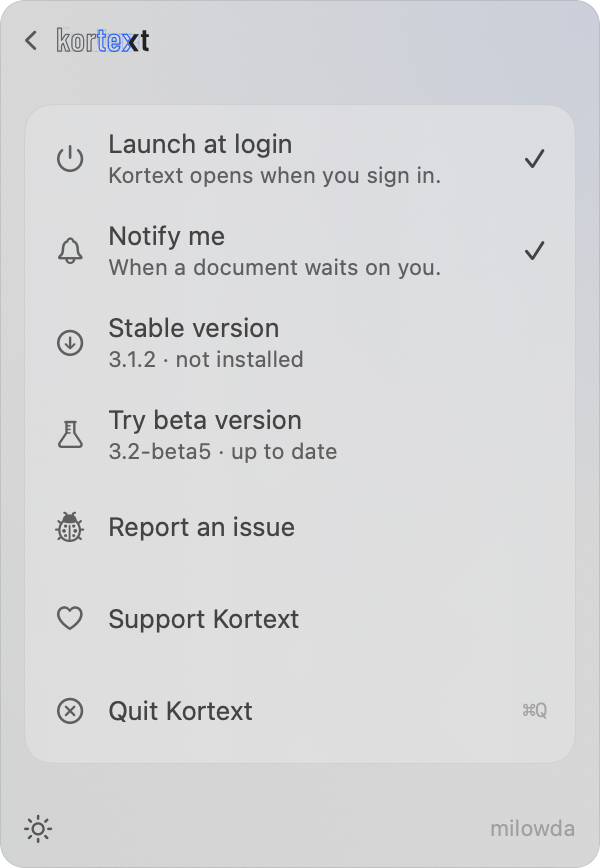

# macOS Menu Bar App

🇹🇷 [For Turkish press 1](tr/MACOS.md)

An optional companion app for macOS. Not a second product — a window that makes Kortext's process easier to keep an eye on.

## Install

[Kortext must be installed](INSTALL.md) first. If it is not, the app says so and shows the install command.

The latest version: [Kortext.zip](https://github.com/erayendes/kortext/releases/latest/download/Kortext.zip) — every version is under [GitHub Releases](https://github.com/erayendes/kortext/releases).
Open the archive, drag Kortext.app into /Applications and open it.
The app is notarized, and from then on it updates itself. — That is the only thing you have to do to install it.

## How to use it

  
  

If the server is not running when you open the app, it is started in the background. No terminal command needed.
The icon in the menu bar shows how many documents wait on you.

One card per project. Click a row that needs a decision and the [panel](GUIDE.md) opens on that document. When nothing waits on you, it says so.

At the bottom, ⏻ starts the server; pressed twice, it stops it.
**open panel** beside it opens the panel in your browser.

## Notifications

It tells you when something changes: a document is waiting for approval, a step failed, a document came back with questions, a chain is complete.

Click a notification and the panel opens on that document.

[README](../README.md) · [INSTALL](INSTALL.md) · [GUIDE](GUIDE.md) · [MACOS](MACOS.md) · [SUPPORT](../.github/SUPPORT.md) · [SECURITY](../.github/SECURITY.md) · [CHANGELOG](CHANGELOG.md)
