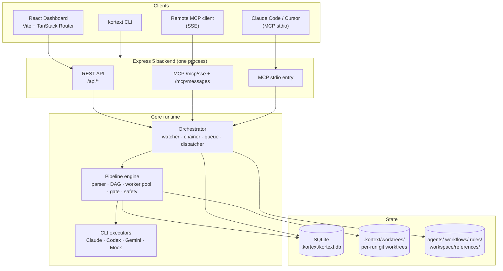
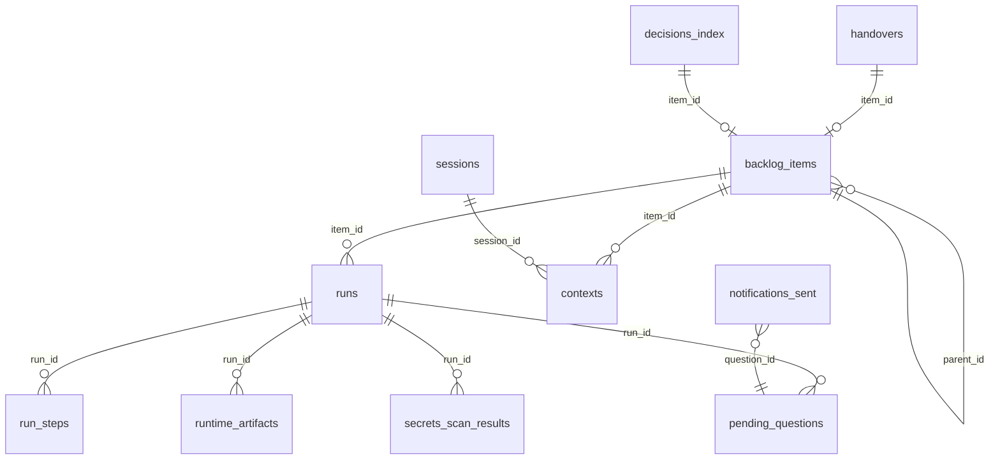
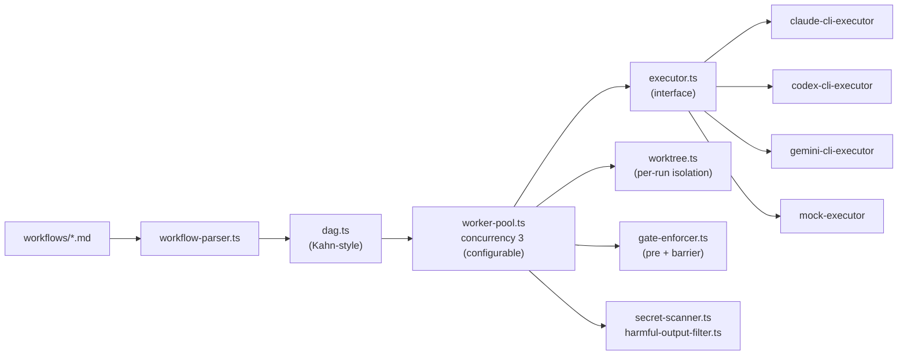
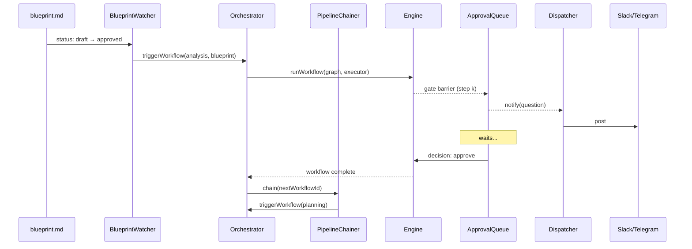
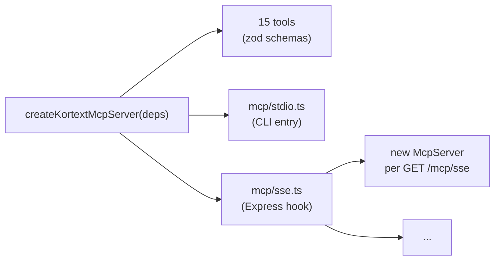
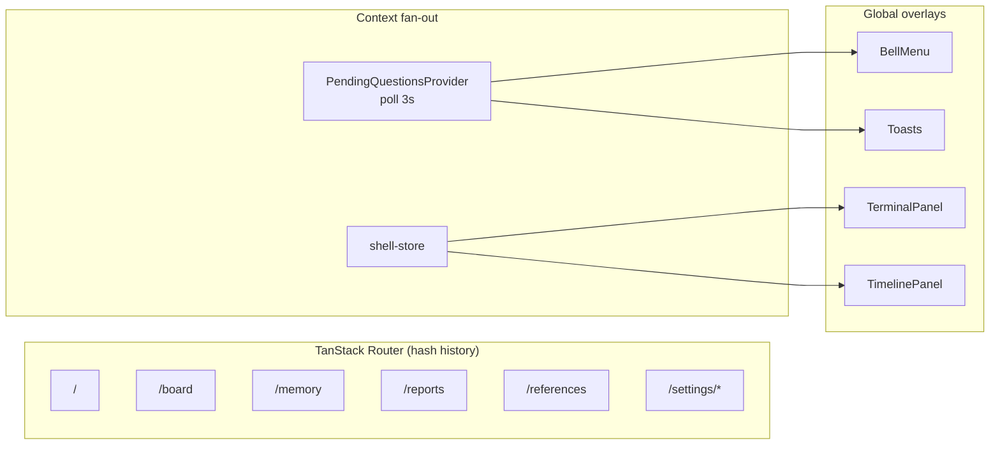
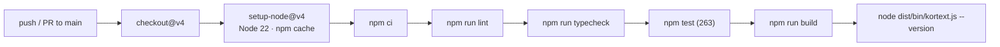

# Kortext v3 — Architecture

This document describes the runtime architecture of Kortext v3. It is meant
for developers contributing to Kortext or integrating against it. For an
end-user walkthrough, see [USER-GUIDE.md](../USER-GUIDE.md).

## Layers at a glance



Single Node process. The MCP stdio entry is a separate process (one per
host CLI) that shares the factory and dependencies but mounts its own
transport.

## Data layer

### Hybrid: markdown + SQLite

| What | Where | Why |
|---|---|---|
| Blueprint, ADRs, references | `workspace/references/*.md` | Human authoring; long-form |
| Personas | `agents/*.md` | Human-editable; hot-reloaded |
| Workflows | `workflows/*.md` | Human-readable DAGs |
| Rules | `rules/*.md` | Human-readable; loaded into prompts |
| Backlog | SQLite `backlog_items` | Frequent state changes; relational |
| Runs / steps | SQLite `runs`, `run_steps` | Time-series; queried by status |
| Approvals | SQLite `pending_questions` | First-class lifecycle |
| Audit | SQLite `audit_log` | Append-only; queried by actor/action |
| Generated artifacts | Disk + SQLite index | Disk for history, index for search |

Two principles:

- **Human sources are read-only to the engine.** Personas and workflows
  are parsed in memory; the engine never writes them back.
- **Generated markdown gets an index row** in `runtime_artifacts` so the
  dashboard can find it without scanning the filesystem.

### SQLite schema (13 tables)



Specifics worth knowing:

- **All timestamps are `INTEGER` Unix milliseconds.** Read with
  `new Date(ms)` on the dashboard side.
- **All JSON columns are `TEXT`** plus json1 access. Helpers in
  `server/db/json.ts` parse on read and serialize on write.
- **WAL mode is on.** Required because the dashboard polls every 3 seconds
  while the engine writes step status concurrently.
- **Foreign keys are enforced.** `PRAGMA foreign_keys = ON` is set in
  `server/db/client.ts`.
- **Migrations** live in `server/db/migrations/*.sql` and run on first DB
  open. `npm run build:server` copies them into `dist/server/db/migrations/`
  so installed packages can boot from scratch.

## Engine



### Workflow parsing

`workflow-parser.ts` reads YAML frontmatter (`id`, `nextWorkflowId`, `gates`)
and the `## Steps` section. Each `### step_name` block becomes a typed
step with `persona`, `inputs`, `outputs`, optional `gate`. The parser is
intentionally minimal — full YAML is not required.

### DAG construction

`dag.ts` walks every step and matches each `inputs[]` entry against
**`outputs[]`** from earlier steps. A step depends on the step that
produces its inputs. Inputs that no step produces are flagged as
`externalInputs` — these get checked by the gate enforcer.

Kahn-style topological sort detects cycles. Cycle = workflow rejected at
load time, never reaches the runtime.

### Worker pool

`worker-pool.ts` is a **pull-ready scheduler**, not a topological queue:

1. Initial ready set = nodes with zero dependencies.
2. Up to `concurrency` workers are spawned (default 3, configurable per run).
3. Each worker pulls one ready step, executes it, marks it `succeeded` /
   `failed`, and re-evaluates the ready set.
4. On first `failed`, an `AbortController` cancels in-flight steps and the
   remaining graph is marked `skipped`.
5. Gates pause the pool via a `gateController.pauseAtGate` barrier; resume
   re-enters the same pool with the gate decision in hand.

### Gate enforcement

Two kinds of gate:

- **Pre-gate (`externalInputs`):** the workflow declares external inputs
  (e.g. `blueprint.md`); the enforcer checks each one's frontmatter has
  `status: approved` before the run starts.
- **Mid-run barrier (`gate: true`):** the worker pool halts after the step
  completes, writes a row to `pending_questions`, and waits for an
  `approval-queue` decision.

A rejected gate flips the run to `cancelled` with
`error_message: rejected: <reason>` and quarantines the worktree.

### Per-run worktrees

`worktree.ts` calls `git worktree add .kortext/worktrees/run-<id>` on a
branch named `kortext/run-<id>`. The namespace prevents collisions with
your own branches.

On success the engine can merge into the source branch and remove the
worktree (off by default). On failure the worktree is moved to
`.kortext/worktrees/quarantine/run-<id>-<timestamp>/` and the branch is
preserved.

`kortext cleanup --quarantine-older-than=Nd --branches` removes quarantined
worktrees and the matching branches after they age out.

### Output safety

After each successful step the engine runs:

- **Secret scanner** — four pattern groups (quoted assignment, env
  assignment, service token, auth header) with allow-listed exceptions
  (`process.env`, `YOUR_…`, `PLACEHOLDER`, `.env*`). Findings flip the step
  to `failed` with a masked snippet recorded in `secrets_scan_results`.
- **Harmful-output filter** — configurable banned-phrase list. The v3.0
  implementation is a placeholder; a content-policy pass lands in v3.1+.

## Orchestrator



### Pipeline chainer

`pipeline-chainer.ts` reads the completed workflow's `nextWorkflowId` and
triggers the next run with the same item context. Chain breaks if
`nextWorkflowId` is missing or the previous run is in a terminal-failed
state.

### Approval queue

`approval-queue.ts` writes a `pending_questions` row, notifies, and exposes
three REST endpoints:

- `GET /api/questions` — list open
- `POST /api/questions/:id/answer` — resolve with `{ decision, reason? }`
- `POST /api/runs/:runId/approve` — sugar for resolving the most recent
  open question on a run

The same surface is exposed via MCP (`list_pending_questions`,
`respond_to_question`).

### Notification dispatcher

`notifications/dispatcher.ts` fans out to `slack.ts` and `telegram.ts`,
deduplicated by `(channel, kind, resource_id)` and recorded in
`notifications_sent`. Restarting the runtime never replays old events.

### Resume semantics

`resume.ts` runs on server boot. Any row in `runs` with `status: running`
is reclassified to `cancelled` with `error_message: orphaned: server
restarted`. `orchestrator.retryRun(runId)` can pick orphaned runs up from
their last persisted gate (pre-completed gates are replayed in order).

## MCP server



Key decisions:

- **Factory + injectable deps.** Tests, stdio, and SSE all call the same
  factory with mocked or real dependencies (db, orchestrator,
  registries).
- **SSE per-session McpServer instance.** The MCP SDK ties handler state
  to the transport; multiplexing one server across two transports leaks
  state. `mcp/sse.ts` creates a fresh `McpServer` per `GET /mcp/sse`,
  keys a `transports` map by `sessionId`, and cleans up on `onclose`.
- **Stdio console patch.** Stdout is the JSONRPC channel. `bin/kortext.ts
  mcp` re-routes `console.log` → `console.error` at startup. New modules
  must default to `console.error` for any logging.
- **Tool envelope = JSON text + structuredContent.** Every tool returns
  `{ content: [{type:'text', text: JSON.stringify(...)}], structuredContent }`
  so old clients see text frames and new clients get structured payloads.

The 15 tools:

| Group | Tools |
|---|---|
| Workflow | `list_workflows`, `list_personas`, `list_pipelines`, `get_pipeline`, `start_pipeline` |
| Backlog | `list_backlog`, `add_backlog_item`, `transition_item` |
| Approval | `list_pending_questions`, `respond_to_question` |
| Context | `get_context`, `handover`, `get_logs` |
| Blueprint | `read_blueprint`, `approve_blueprint` |
| Health | `get_runtime_status` |

## Dashboard



Implementation notes:

- **Hash history** so the Express side never needs an SPA fallback. Static
  `dist/web` serves the bundle from any subpath.
- **Tailwind v4 `@theme inline` + CSS variables.** Palette tokens are a
  single source — both `var(--accent)` and `bg-accent` work.
- **API type mirror.** `src/lib/api-types.ts` hand-mirrors server response
  shapes so the frontend bundle never picks up transitive
  `better-sqlite3`.
- **Allow-listed `/api/docs/:scope`.** Five scopes
  (`references | reports | memory | rules | workflows`). `path.resolve` +
  prefix check blocks traversal.
- **Marked + DOMPurify.** Every markdown render is sanitized.
- **Single polling source.** `PendingQuestionsProvider` is the only thing
  hitting `/api/questions`; the bell, toast emitter, and dashboard card
  all subscribe.

## CLI

```
bin/kortext.js  (dual-mode shim)
  ├── dist/bin/kortext.js exists?  → in-process import (fast)
  └── otherwise                    → spawn `tsx bin/kortext.ts` (dev)

bin/kortext.ts
  ├── --version / --help (top-level)
  ├── init    → server/cli/init.ts        (pure: scaffold plan)
  ├── serve   → server/cli/serve.ts       (pure: buildServeCommands)
  ├── start   → server/cli/commands.ts    (orchestrator)
  ├── approve → server/cli/commands.ts
  ├── status  → server/cli/commands.ts
  ├── logs    → server/cli/logs.ts        (pure: query plan)
  ├── cleanup → server/cli/cleanup.ts
  ├── doctor  → server/engine/consistency.ts
  └── mcp     → mcp/stdio.ts
```

Command modules under `server/cli/` are **pure** — they never call
`console.*`. The bin layer formats data and owns stdout/stderr. This is
what makes the CLI unit-testable without spawning processes.

## CI



`cancel-in-progress: true` on the workflow concurrency group supersedes
older runs for the same ref. The compiled-CLI smoke is the gate that
caught the `packageRoot()` walk-up bug — installed users always see the
fast `dist/` path, so the version-reporting bug would have shipped
otherwise.

## Where to look in the codebase

| Concern | File |
|---|---|
| Schema | `server/db/migrations/001_init.sql` |
| DB client | `server/db/client.ts` |
| Repositories | `server/db/repositories/*.ts` |
| Workflow parsing | `server/engine/workflow-parser.ts` |
| DAG construction | `server/engine/dag.ts` |
| Worker pool | `server/engine/worker-pool.ts` |
| Worktree manager | `server/engine/worktree.ts` |
| Gate enforcer | `server/engine/gate-enforcer.ts` |
| Output safety | `server/safety/secret-scanner.ts`, `server/safety/harmful-output-filter.ts` |
| Orchestrator | `server/orchestrator/orchestrator.ts` |
| Blueprint watcher | `server/orchestrator/blueprint-watcher.ts` |
| Pipeline chainer | `server/orchestrator/pipeline-chainer.ts` |
| Approval queue | `server/orchestrator/approval-queue.ts` |
| Notifications | `server/notifications/{dispatcher,slack,telegram}.ts` |
| MCP factory | `mcp/server.ts` |
| MCP stdio | `mcp/stdio.ts` |
| MCP SSE | `mcp/sse.ts` |
| CLI bin | `bin/kortext.ts`, `bin/kortext.js` |
| Dashboard | `src/router.tsx`, `src/routes/*`, `src/components/*` |

For day-to-day operations see [USER-GUIDE.md](../USER-GUIDE.md); for the
ten-phase delivery timeline see [ROADMAP-v3.md](../ROADMAP-v3.md).
