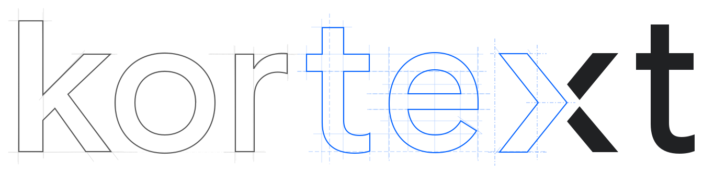

<p align="center">
  <picture>
    <source media="(prefers-color-scheme: dark)" srcset="../assets/kortext-logo-dark.svg">
    
  </picture>
</p>

<p align="center">
  <a href="https://www.npmjs.com/package/kortext"></a>
  <a href="https://github.com/erayendes/kortext/actions/workflows/kortext-ci.yml"></a>
  
  <a href="../../LICENSE"></a>
  <a href="https://milowda.com"></a>
</p>

🇬🇧 [For English press 9](../../README.md)

**Yapay zekâ ile geliştirilen projelerin beyni.** Kortext, elinizdeki bir brief'i — ya da
zaten yazılmış bir kod tabanını — onaylı bir analiz temeline dönüştürür. Bunu yaparken kendi
kodlama ajanınızı kullanır: Claude Code, Codex, Gemini CLI, hangisi kuruluysa. Analiz boyunca
panelden hiç çıkmazsınız. Belgeler taslak olarak gelir; siz okur, onaylar, not düşer ya da
"bunu şöyle yazsana" dersiniz. Zincir sizin onaylarınızla ilerler. Son belge de yerine
oturduğunda Kortext kenara çekilir: belgeler artık projenin kılavuzudur, `AGENTS.md` de
ajanınıza teslim edilen sözleşme.

Kortext'in kendi API anahtarı yoktur, kendi adına hiçbir modeli çağırmaz. Bilgisayarınızda
zaten kurulu olan, ücretini zaten ödediğiniz ajan CLI'ını alır ve repo'nuzun içinde, sessizce
çalıştırır.

<p align="center">
  
</p>

## Nasıl çalışır

1. **Bir proje ekleyin.** Repo klasörünü ve hangi ajan CLI'ıyla çalışacağını seçin. Bu seçim
   projeye aittir; iki projeniz iki ayrı CLI'da rahatça yaşayabilir. *Yeni proje* formda
   yazdığınız ya da yüklediğiniz bir brief'le başlar; *mevcut proje* doğrudan koddan. Kortext
   repo'nun köküne `AGENTS.md`'yi, `.kortext/` altına da belge iskeletlerini yerleştirir.
2. **Analiz.** Kortext, ajan CLI'ınızı bağımlılık sırasına uyan bir iş akışında adım adım
   çalıştırır. Her adım tek bir belge yazar — ARCHITECTURE, STACK, SECURITY, DATABASE, DESIGN,
   LEGAL… — ve bunu bir persona olarak yapar: mimar, güvenlik mühendisi, tasarımcı. Belge
   `draft` olarak gelir. Girdilerini henüz onaylamadığınız bir belge asla yazılmaz. Birbirinden
   bağımsız en fazla üç adım aynı anda koşar; siz bir şeyi onayladığınızda zincir uyanır.
3. **Panelde inceleyin.** Herhangi bir belgeyi açın. Onaylayabilirsiniz; bir satır seçip "bunu
   neden böyle yazdın?" diye yazarına sorabilirsiniz (bu sohbet geçicidir, hiçbir yere
   yazılmaz); ya da notlar bırakıp revizyon isteyebilirsiniz — o zaman belgeyi yazan adım
   notlarınızla yeniden koşar. Bir belge "bu projede buna gerek yok" diyerek, gerekçesiyle,
   `not-applicable` olarak da kapanabilir.
4. **El sıkışma.** Bütün belgeler onaylandığında ya da gerek yok dendiğinde analiz bitmiştir.
   Belgeler artık projenin anayasası, `AGENTS.md` de devir teslim metnidir. Başlangıç
   komutlarından birini kendi istemcinize — CLI ya da uygulama, hangisini kullanıyorsanız —
   kopyalayın ve yapmaya başlayın.

## Neye ihtiyacınız var

| | en az | neden |
| --- | --- | --- |
| **Node.js** | 22 | çalışma ortamı |
| **npm** | 10 | Node 22 ile birlikte gelir |
| **Bir ajan CLI'ı** | aşağıdaki dörtten biri | Kortext'in sürdüğü motor |

Kortext'e anahtar vermezsiniz; zaten kullandığınız CLI'ın aboneliğini harcar. Hangisini
kullanıyorsanız onu kurmanız yeter. Kortext için hepsi eşittir; `PATH`'inizde hangisini bulursa
onu kullanır. Cursor, Copilot, OpenCode, Amp, Droid, Goose, Qwen Code ve Cline için de tanımlar
hazır — gerçek bir makinede belge yazana kadar listede *untested* etiketiyle dururlar; denerseniz
nasıl gittiğini bize yazın. Git zorunlu değildir.

```sh
npm install -g @anthropic-ai/claude-code    # claude
npm install -g @openai/codex                # codex
npm install -g @google/gemini-cli           # gemini
# antigravity: Antigravity uygulamasını kurun, sonra `agy install`
```

## Kurulum

```sh
npm install -g kortext
```

npm artık paketlerin kurulum betiklerini kendiliğinden çalıştırmıyor. Kortext'in SQLite
bağlayıcısı yaygın platformlar için hazır derlenmiş geldiğinden bu komut çoğu zaman yeter.
`kortext` açılıp da veritabanını açamazsa, betiğe bir kerelik izin vererek yeniden kurun:

```sh
npm install -g --allow-scripts=better-sqlite3 kortext
```

Node 22'nin kendisi için, platformunuza göre:

<details>
<summary><b>macOS</b></summary>

```sh
brew install node@22
```

Birden fazla Node sürümüyle uğraşıyorsanız: `brew install fnm && fnm install 22 && fnm default 22`.
</details>

<details>
<summary><b>Windows</b> — deneysel</summary>

> **Windows desteği deneyseldir.** Kortext macOS ve Linux'ta geliştiriliyor ve orada test
> ediliyor. Windows'a özgü kısımlar — ajan CLI'ını `where` ile bulmak, npm'in kurduğu `.cmd`
> shim'ini çalıştırmak — belgelenmiş davranışa göre yazıldı ama gerçek bir Windows'ta
> koşturulmadı. Bir şey çalışmazsa lütfen
> [bir issue açın](https://github.com/erayendes/kortext/issues); sorun sizin kurulumunuz değil,
> bizim eksiğimizdir.

Node 22'yi **nodejs.org**'dan kurun (v22.x etiketli LTS). *Tools for Native Modules* ekranında
**"Automatically install the necessary tools"** kutusunu işaretleyin; Kortext'in SQLite
bağlayıcısının bunlara ihtiyacı var.

Global kurulumda `EACCES` ya da izin hatası alırsanız, yönetici kabuğu açmak yerine npm'in global
klasörünü kendi klasörünüze çevirin:

```powershell
npm config set prefix "$env:APPDATA\npm"
```

ve `%APPDATA%\npm`'i `PATH`'inize ekleyin.
</details>

<details>
<summary><b>Linux</b></summary>

```sh
sudo apt install -y curl build-essential python3      # SQLite bağlayıcısı için gcc/make
curl -o- https://raw.githubusercontent.com/nvm-sh/nvm/v0.40.3/install.sh | bash
nvm install 22 && nvm alias default 22
```

`sudo npm install -g` yapmayın. `EACCES` görürseniz:
`npm config set prefix ~/.npm-global`, sonra `~/.npm-global/bin`'i `PATH`'inize ekleyin.
</details>

## Hızlı başlangıç

**Node 22 veya üstü** ve PATH'inizde en az bir ajan CLI'ı olsun yeter
(`claude`, `codex`, `antigravity` ya da `gemini`).

```sh
npm install -g kortext
kortext
```

Sunucu **3441** portunda açılır (`--port` ile değiştirebilirsiniz) ve panel karşınıza gelir.
Verileriniz tek bir global SQLite veritabanında durur: `~/.kortext/kortext.db` (`--db` ile
değiştirebilirsiniz). Belgelerse sizin repo'nuzda yaşar.

## Repo'nuza ne gelir

```
AGENTS.md                  ajanın giriş sözleşmesi (devir teslim metni)
.kortext/                  bütün belgeler, tek raf, yazıldıkları sırayla
  BRIEF.md PRODUCT.md STACK.md STRUCTURE.md ARCHITECTURE.md SECURITY.md
  ENVIRONMENT.md DATABASE.md API.md DESIGN.md GROWTH.md LEGAL.md
  CONTENT.md ENGINEERING.md TEST.md
```

Bir belgenin durumu frontmatter'daki `status` alanında yazar ve doğru olan odur:
`uninitialized → draft → approved` (ya da `not-applicable`).

## Çalıştığından emin olun

```sh
node --version                          # v22 ya da üstü
kortext --version
which claude || which codex || which agy || which gemini
```

Bir CLI'ın kurulu olması oturum açmış olduğu anlamına gelmez. Kortext'i gerçek bir projeye
yöneltmeden önce CLI'ınızı bir kez tek başına çalıştırıp giriş yaptığınızdan emin olun. CLI,
proje eklerken formda seçilir; proje ekranında Start'ın yanında aynı liste durur — kotanız
bittiğinde oradan başka bir CLI'a geçebilirsiniz. Hiçbiri kurulu değilse panel bunu başlığında
söyler.

## Başlatma ve durdurma

`kortext` sunucuyu arka planda başlatır ve paneli açar. Terminal penceresini kapatabilirsiniz;
panel çalışmaya devam eder. Durdurmak için panelin durum çubuğundaki ⏻ düğmesine basın. Aynı
çubuktaki nokta sunucu ayaktayken yeşil, kapandığında kırmızıdır. Yeniden başlatmak için tekrar
`kortext` yazmanız yeter.

```sh
kortext              # arka planda başlat, paneli aç
kortext --stop       # arka plandaki sunucuyu durdur
kortext --no-detach  # bu terminalde tut, Ctrl+C ile durdur
```

Ne düğme ne `--stop` koşan bir adımı yarıda keser; biri sürerken beklemenizi ister. Böylece bir
analiz yazımın ortasında kesilmez.

Arka plandaki sunucunun yazdıkları `~/.kortext/kortext.db.log` dosyasında birikir.

## Güncelleme ve kaldırma

Yeni bir sürüm çıktığında panel başlığın altında bir şeritle haber verir. **Update now** düğmesi
kurulumu sizin yerinize yapar; yeni sürüm, kortext'i kapatıp yeniden açtığınızda devreye girer.
Düğme, koşan bir adım varsa dosyaları onun altından değiştirmez, bitmesini bekler. Elle yapmak
isterseniz, ya da düğme hata verirse:

```sh
npm update -g kortext
npm uninstall -g kortext
```

Kaldırmak yalnızca programı siler. Proje kaydınız ve loglar `~/.kortext/`'te, belgeleriniz de
repo'nuzda olduğu gibi kalır. Tertemiz bir başlangıç istiyorsanız ikisini de kendiniz silin.

## Geliştirme

```sh
npm install && npm --prefix ui install
npm run dev        # sunucu :3441 (tsx watch)
npm run dev:web    # vite panel :3442 (proxy /api → 3441)
npm test           # node:test takımı
npm run typecheck  # sunucu + panel
npm run format     # prettier yazar; format:check doğrular (CI bu kontrolü çalıştırır)
npm run build      # tsc → dist/ + vite → ui/dist/
```

Issue ve pull request'lerinizi bekliyoruz — bkz. [CONTRIBUTING](../../.github/CONTRIBUTING.md),
[SUPPORT](../../.github/SUPPORT.md) ve [güvenlik politikası](../../.github/SECURITY.md).

Kortext ücretsizdir ve MIT lisanslıdır. İşinizde bir yer edinirse,
[sponsor olmanız](https://buymeacoffee.com/erayendes) bakımının sürmesini sağlar.

## Belgeler

[Kılavuz](GUIDE.md) — panelin anlatımı · [Değişiklik günlüğü](CHANGELOG.md)

## Lisans

MIT © Eray Endes
