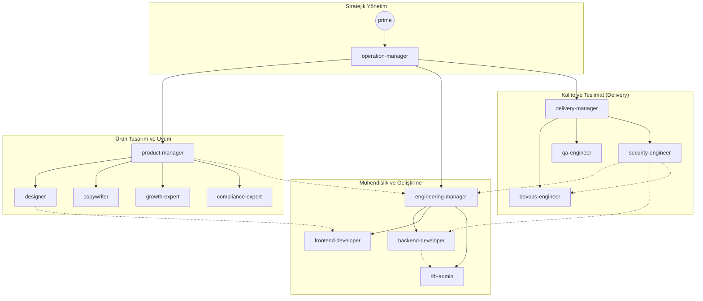

# 🧠 Kortext: AI Agent Protocols
```
- status: final | v2.2.0 | 16.05.2026
- author: +prime
```

> 📖 **Kortext'i ilk kez kullanıyorsan:** [`USER-GUIDE.md`](USER-GUIDE.md) ile başla.
> 🔧 **Teknik referans:** Bu dosya. 📋 **Değişiklik geçmişi:** [`CHANGELOG.md`](CHANGELOG.md)

Kortext, birden fazla personanın (`/agents/`) kendi rolleri, yetenekleri ve görevleri doğrultusunda; belirlenmiş olan kural (`/rules/`) ve talimatlara (`/workflows/`) uygun olarak projeyi (`/workspace/`) hayata geçirme adımlarını tanımlar. 

> Tüm dosya ve dizinler proje kökündeki `.kortext/` altında yer alır. Başlangıç komut dosyası (`AGENTS.md`) proje kök dizininde yer alır:
 
```text
.kortext/
├── agents/                 # Uzmanlaşmış persona tanımları, yetkiler ve iş akışları
├── hooks/                  # Otomatik sistem denetimleri, Git kalkanları ve güvenlik tetikleyicileri
├── rules/                  # Projeden bağımsız, tüm personaların uyması gereken katı kurallar
├── scripts/                # Operasyonel scriptler (lock_kortext.sh vb.)
├── skills/                 # Proje bazlı yetenek setleri ve best-practice yönergeleri
├── workflows/              # Geliştirme süreçlerinde takip edilecek zorunlu adımlar
├── workspace/              # Projeye özel dosyalar ve şablonlar dizini
│   ├── archive/            # Arşivlenmiş görev ve bellek dosyaları
│   ├── backups/            # Otomatik dosya yedekleri (Snapshot)
│   ├── memory/             # Tüm personaların erişebildiği ortak proje hafıza alanı
│   ├── references/         # Projenin "Single Source of Truth" (gerçeklik) dosyaları
│   └── reports/            # Proje süresince oluşturulan periyodik raporlar
└── README.md                # Kortext genel yapısını anlatan ana doküman
```

# AI Agent Protocols
Bu dosya birden fazla personanın (agent) kendi rolleri, yetenekleri ve görevleri doğrultusunda; belirlenmiş olan kural ve talimatlara uygun olarak projeyi hayata geçirme adımlarını anlatır. 

## `/agents/`
Yalnızca bir göreve odaklanmış, uzmanlaşmış (agent) personalar.

### Persona Hiyerarşisi



**+prime:** Projenin sahibi, vizyoneri ve nihai karar vericisidir. Süreçleri tetikler, stratejik onayları verir, bütçe/kaynak limitlerini belirler. Tüm sistemin en üst otoritesidir. **İNSAN rolüdür — AI personu değildir.**
- **Artifacts:** `/workspace/references/blueprint.md`
- **Lead:** -

**+operation-manager:** Sistemin genel işleyişinden, verimliliğinden ve orkestrasyondan sorumludur. Tüm tepe görev dağılımlarını yapar. Personaların çalışma performansını, token kullanım maliyetlerini ve ekipler arası iletişim pürüzlerini denetler. Start ve kickoff süreçlerini yönetir.
- **Artifacts:** `/workspace/reports/status-reports.md`
- **Lead:** +prime

**+product-manager:** +prime'ın vizyonu çerçevesinde ürün backlog'undan ve gereksinimlerden sorumlu personadır. Kullanıcı ihtiyaçlarını analiz ederek tasarım, metin yazarlığı, büyüme ve uyumluluk konularını yönetir. Ek olarak, proje yönetimi araçlarındaki operasyonel süreçleri (Epic, Story, Task) takip eder.
- **Artifacts:** `/workspace/reports/product-requirements.md`
- **Lead:** +operation-manager

**+designer:** Ürünün görsel dilini ve kullanıcı deneyimini (UI/UX) tasarlar. +frontend-developer'ın çıktılarını kontrol ederek görsel bütünlüğü sağlar.
- **Artifacts:** `/workspace/references/design-system.md`
- **Lead:** +product-manager

**+copywriter:** Tüm metinlerden ve marka sesinden sorumludur. Uygulama içi mikro metinleri, bildirimleri ve pazarlama metinlerini yazar, çevirilerini yapar.
- **Artifacts:** `/workspace/references/content-strategy.md`, `/workspace/reports/content-reports.md`
- **Lead:** +product-manager

**+growth-expert:** Projenin analitik altyapısını verilen araçlara göre kurar. Projenin erişebilirliğini artırmak ve doğru ölçümlemesini yapabilmek için gerekli olan tüm süreçleri ve (Schema.org, SEO/GEO, Google Search Console, Google Tag Manager, GA4, Firebase Analytics vb.) araçları yönetir. Veri toplama stratejilerini belirler ve entegrasyon görevlerini oluşturur. 
- **Artifacts:** `workspace/references/growth-strategy.md`, `workspace/reports/growth-reports.md`
- **Lead:** +product-manager

**+compliance-expert:** Projenin KVKK, GDPR vb. sektörel yasal düzenlemelere uygunluğunu denetler. Kurulum aşamasındaki yasal stratejiyi belirler; dönemsel yasal denetimleri ayrıca raporlar.
- **Artifacts:** `/workspace/references/legal-strategy.md`, `/workspace/reports/legal-reports.md`
- **Lead:** +product-manager

**+engineering-manager:** Üretim hattının teknik lideridir. Teknoloji seçimini yapar, mimariyi çizer ve geliştirme süreçlerinin kalitesinden (Code Review) sorumludur. Teknik kararları (`dictionary.md`, `file-system.md`, `tech-stack.md`) belgeleyerek, backend, frontend ve veritabanı uzmanlarının bu rotada ilerlemesini sağlar.
- **Artifacts:** `/workspace/reports/tech-requirements.md`, `/workspace/references/tech-stack.md`, `/workspace/references/file-system.md`, `/workspace/references/dictionary.md`
- **Lead:** +operation-manager

**+backend-developer:** Sunucu tarafı mantığını, API yapılarını ve veritabanı entegrasyonlarını kodlar. +engineering-manager'ın standartlarına göre sistem inşa eder.
- **Artifacts:** API Endpoint Code
- **Lead:** +engineering-manager

**+frontend-developer:** +designer tarafından hazırlanan çıktıları ve +engineering-manager’in teknik direktiflerini temel alarak kullanıcı arayüzünü koda döker.
- **Artifacts:** UI Components
- **Lead:** +engineering-manager

**+db-admin:** Veri modellemesinden, veritabanı şemasının tasarımından ve optimizasyonundan sorumludur.
- **Artifacts:** `/workspace/references/db-schema.md`
- **Lead:** +engineering-manager

**+delivery-manager:** Yazılımın üretim bandından çıkıp son kullanıcıya ulaşana kadarki tüm sürecin (Delivery Pipeline) orkestrasyonundan sorumludur. Ayrıca genel dökümantasyon süreçlerini de yönetir.
- **Artifacts:** `/workspace/reports/delivery-reports.md`, `/workspace/reports/release-notes.md`
- **Lead:** +operation-manager

**+devops-engineer:** CI/CD süreçlerinin kurgulanması, sunucu kurulumları, ortam değişkenlerinin yönetimi ve Git versiyonlama süreçlerinden (branch stratejisi, merge vb.) sorumludur.
- **Artifacts:** CI/CD Pipelines
- **Lead:** +delivery-manager

**+qa-engineer:** Test senaryolarını yazar, otomatik ve manuel testleri işletir.
- **Artifacts:** `/workspace/references/test-strategy.md`, `/workspace/reports/test-reports.md`
- **Lead:** +delivery-manager

**+security-engineer:** Siber güvenlik kalkanı görevini üstlenir; açık tespiti yapar, ağ ve kod güvenliğini denetler, ilgili politikaları uygular.
- **Artifacts:** `/workspace/references/security-rules.md`, `/workspace/reports/security-reports.md`
- **Lead:** +delivery-manager

## `/skills/`
Personaların projeye göre başvuracağı yetenek setleri ve best-practice yönergeleridir. Ortak komut setleri ve rollere özel beceriler dinamik olarak güncellenir.

## `/hooks/`
Sistemin kurallarını teknik olarak zorlayan güvenlik kalkanları ve Git hook'larıdır. Secret sızıntısı, branch disiplini, backlog drift'i ve handover eksikliği gibi bütünlük risklerini bloklar; yaşam döngüsü kararlarını ise `scripts/` katmanına bırakır.

## `/rules/`
Projeden bağımsız olarak personaların uyması gereken katı kurallardır. Değişiklikler için esneklik yoktur, +prime yetkisine tabidir:

- `behavior.md`: Personaların davranış protokolleri, tonu ve etik kuralları.
- `commands.md`: Süreçleri tetikleyecek komutlar listesi (`!start`, `!deploy`, vb.).
- `emergency.md`: Sistemdeki kritik hatalar, acil durum protokolleri.
- `models.md`: Personaların görev adımlarında hangi AI modelini kullanacağını tanımlayan dosya.
- `branching.md`: Projenin git & versiyonlama yönteminin açıklandığı yer.

## `/workflows/`
Proje geliştirilirken takip edilecek zorunlu iş akışları ve yaşam döngüleri.

- `00-kortext-setup.md`: Framework'ün kurulumu ve ilk yönlendirme kararı.
- `01a-analysis-pipeline.md`: Sıfırdan başlayan projeler için analiz akışı.
- `01b-onboarding-pipeline.md`: Mevcut projeleri Kortext'e dahil etme akışı.
- `02-planning-pipeline.md`: Analiz çıktılarından düz backlog üretme akışı.
- `03-environment-setup.md`: Proje ortamı, erişim ve ilk kurulum akışı.
- `04-development-cycle.md`: "To Do"dan `Review` aşamasına kadar geliştirme yaşam döngüsü.
- `05-test-cycle.md`: `Test` statüsündeki item'ların doğrulama döngüsü.
- `06-deployment-cycle.md`: Staging ve production deployment akışı.
- `07-rollback-pipeline.md`: Son kararlı sürüme güvenli geri dönüş akışı.
- `08-hotfix-pipeline.md`: Kritik production hataları için kontrollü hotfix akışı.
- `02b-spike-workflow.md`: Teknik belirsizliği gidermek için time-boxed araştırma/deneme döngüsü (`!start spike`).
- `09-maintenance-cycle.md`: Rutin sistem bakımı — bağımlılık güncelleme, teknik borç, güvenlik taraması (`!maintenance`).

## `/workspace/references/`
Projenin "gerçeği" olan (Single Source of Truth) referans dosyaları.

- `access.md`: Proje üzerindeki erişim bilgileri ve yetki matrisleri.
- `api-reference.md`: API uç noktalarının (endpoints) teknik dökümantasyonu.
- `blueprint.md`: Projenin mimari genel planı ve üst seviye yol haritası.
- `content-strategy.md`: Metin dili, microcopy ve markalama stratejisi.
- `db-schema.md`: Veritabanı tabloları, ilişkileri ve ERD belgeleri.
- `design-system.md`: Renk paletleri, tipografi ve görsel UI kuralları.
- `dictionary.md`: İsimlendirme standartları (variable, function adlandırması).
- `file-system.md`: Klasör yapısı ve modüler mimari dizilimi.
- `growth-strategy.md`: SEO, analitik ve kullanıcı büyüme rehberi.
- `legal-strategy.md`: KVKK/GDPR uyumluluk stratejisi — analiz fazında `+compliance-expert` tarafından üretilir, `workspace/references/` altında yer alır.
- `security-rules.md`: Güvenlik protokolleri.
- `tech-stack.md`: Teknik altyapı bileşenleri (diller, kütüphaneler).
- `test-strategy.md`: Test metotları ve kalite güvence stratejisi.

## `/workspace/memory/`
Proje süresince tüm personaların okuyabildiği ve üzerinde işlem yapabildiği ortak hafıza alanı.

- `context/`: Mevcut oturumda çalışan ajanların kendi statülerini tuttukları (Distributed Context) canlı hafıza klasörü. Çakışmayı engellemek için her ajan sadece kendi `[agent-name]-active.md` dosyasına yazar.
- `backlog/`: Geliştirme ekibi için önceliklendirilmiş Epic, Task, Bug ve Debt kayıtlarının düz dosya yapısında tutulduğu takip klasörü.
- `decisions.md`: Alınan kritik mimari ve stratejik kararların (ADR) arşivi.
- `handover.md`: Personaların birbirine iş devrederken oluşturduğu, görevin anlık teknik detaylarını barındıran devir raporları.
- `learned.md`: Karşılaşılan hatalardan çıkarılan tecrübeler ve çözümler (Knowledge Base).

## `/workspace/reports/`
Süreç içinde üretilen dönemsel veya doğrulama odaklı raporlar.

- `analysis-reports.md`: `01a` veya `01b` sonunda +operation-manager tarafından oluşturulan konsolide analiz raporu.
- `content-reports.md`: +copywriter tarafından hazırlanan dönemsel içerik çıktıları.
- `delivery-reports.md`: +devops-engineer tarafından tutulan deployment, release ve rollback kayıtları.
- `growth-reports.md`: +growth-expert tarafından hazırlanan büyüme ve analitik sonuç raporları.
- `legal-reports.md`: +compliance-expert tarafından hazırlanan dönemsel yasal denetim raporları; kalıcı strateji kaynağı `references/legal-strategy.md` dosyasıdır.
- `product-requirements.md`: +product-manager tarafından hazırlanan ürün gereksinim dokümanı.
- `release-notes.md`: +delivery-manager tarafından hazırlanan sürüm notları.
- `security-reports.md`: +security-engineer tarafından hazırlanan tarama ve bulgu raporları; kalıcı güvenlik standardı `references/security-rules.md` dosyasıdır.
- `status-reports.md`: +operation-manager tarafından hazırlanan genel durum raporu.
- `tech-requirements.md`: +engineering-manager tarafından hazırlanan teknik gereksinim raporu.
- `test-reports.md`: +qa-engineer tarafından yürütülen doğrulama kayıtlarının ana raporu.


## `/workspace/archive/`
Boyutu çok büyüyen veya dönemi biten dosyaların yedeklenip saklandığı dizin. Kullanılmayan eski logları, devir metinlerini (handover) vb. barındırır.

## `/scripts/` — Operasyonel Script Referansı

| Script | Tetikleyici | Ne yapar |
| :--- | :--- | :--- |
| `kortext-session-start.py` | `kortext-init.sh` (otomatik) | Oturum başlangıcında SESSION_BRIEF üretir: aktif context, son handover, stale itemlar |
| `kortext-context-check.py` | `!status` / manuel | Context bütünlüğünü kontrol eder: stale aktif dosyalar, item ID uyuşmazlıkları, handover güncelliği |
| `kortext-backlog-health.py` | `!status` / `!maintenance` | Backlog sağlık skoru: başlanabilir, bloklu, stale ve review bekleyen itemlar |
| `kortext-lock.py` | `auto-locker.sh` (otomatik) | Paylaşımlı dosyalara eş zamanlı yazma koruması (acquire/release/status/list) |
| `kortext-item-start.py` | Ajan göreve başlarken | Backlog item'ı In Progress yapar, context dosyasını oluşturur |
| `kortext-item-transition.py` | Ajan görevi ilerletirken | Backlog item statüsünü günceller |
| `kortext-handover.py` | Görev kapanışında (zorunlu) | Handover kaydını handover.md dosyasının en üstüne ekler |
| `kortext-item-check.py` | Görev kapanış öncesi | Kapanış koşullarını doğrular |
| `kortext-backlog-sync.py` | Görev kapanışında | Dashboard uyumunu kontrol eder |
| `kortext-backlog-add.py` | Yeni item açılırken | Backlog'a Task/Bug/Debt ekler |
| `kortext-bulk-plan.py` | Planning pipeline | Toplu item oluşturur |
| `kortext-consistency-check.py` | CI / manuel | Framework yapı tutarlılığını doğrular |
